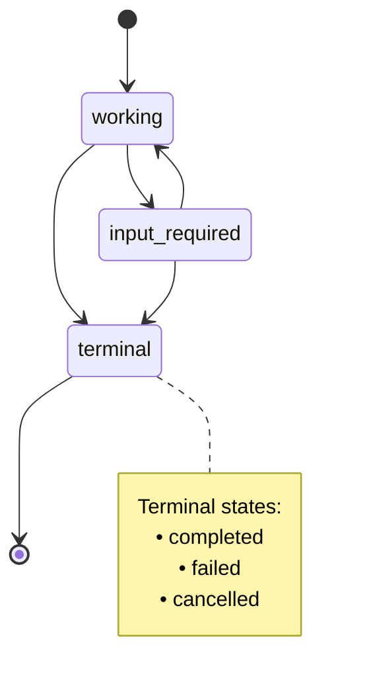
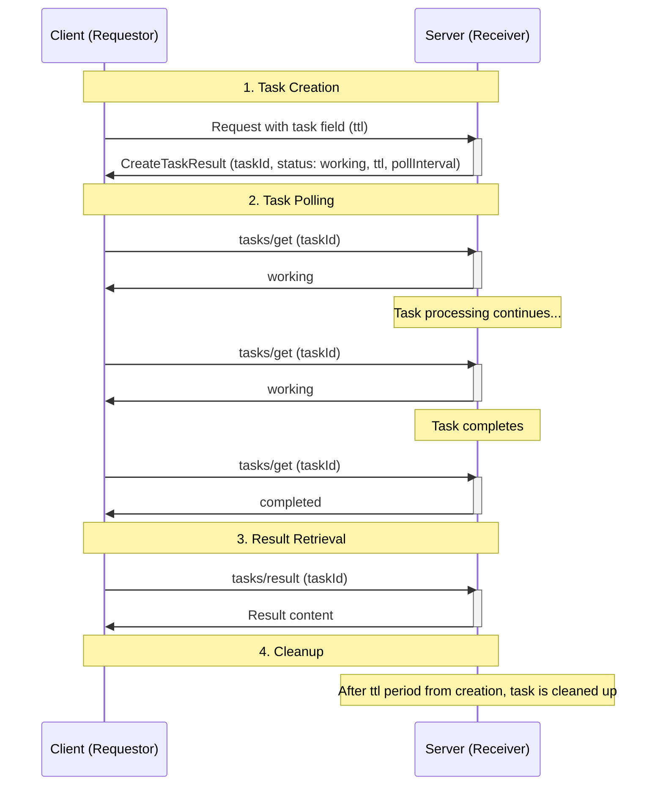
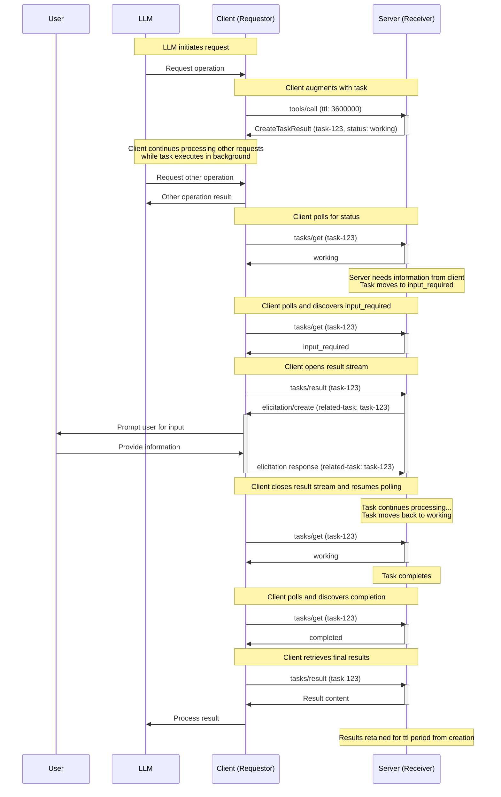
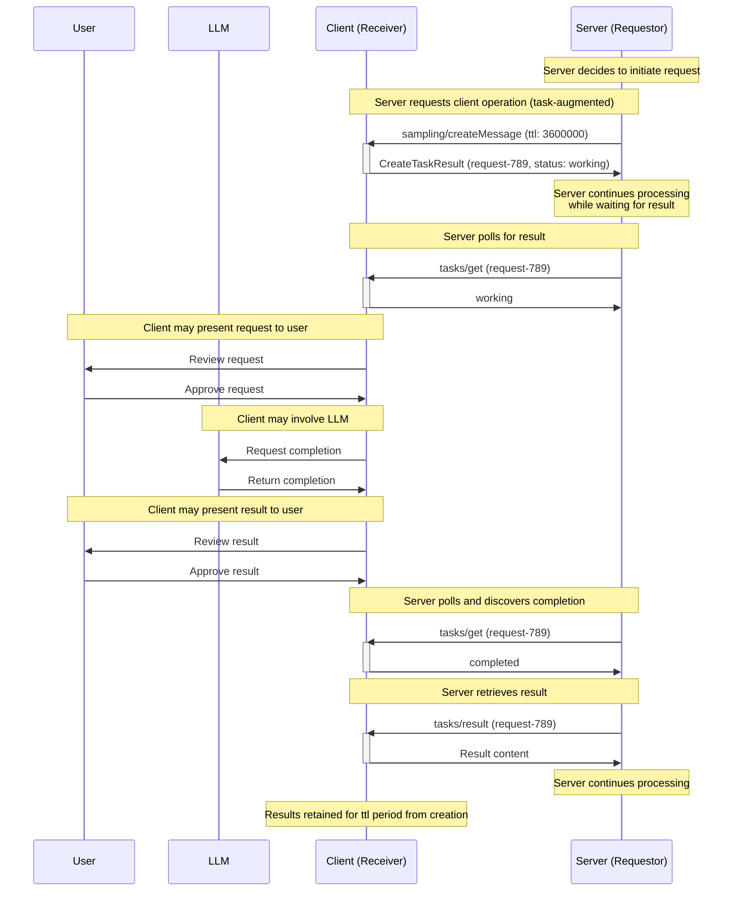
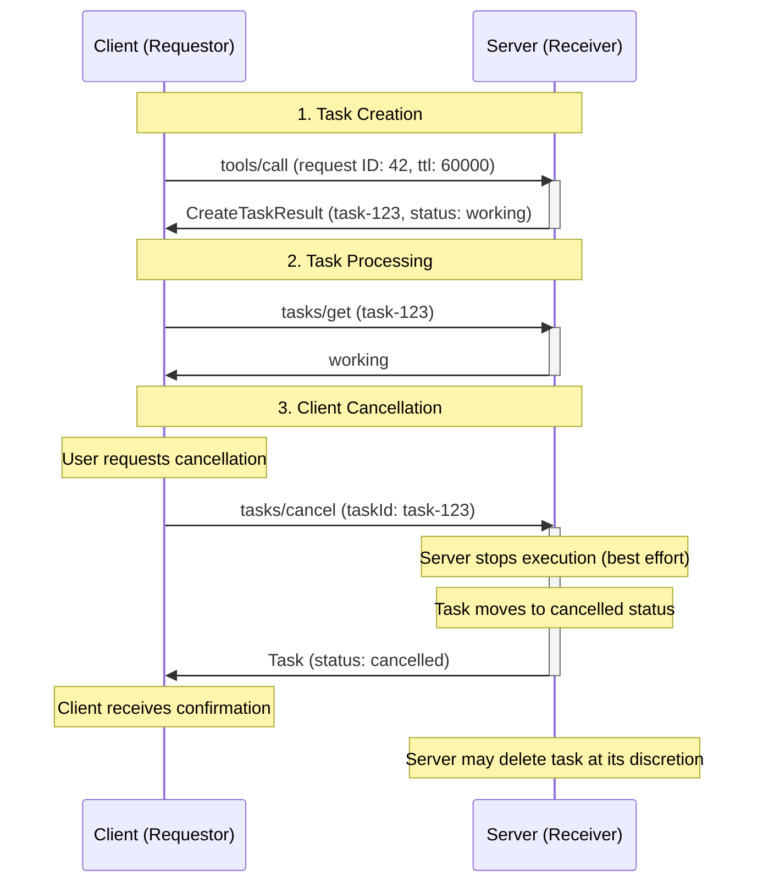

# 작업

<div id="enable-section-numbers" />

<Info>**프로토콜 개정**: 2025-11-25</Info>

<Note>
  작업은 MCP 사양 버전 2025-11-25에 도입되었으며 현재 **실험적**으로 간주됩니다.
  작업의 설계와 동작은 향후 프로토콜 버전에서 변경될 수 있습니다.
</Note>

Model Context Protocol (MCP)은 요청자(통신 방향에 따라 클라이언트 또는 서버가 될 수 있음)가 **작업**을 사용해 요청을 확장할 수 있도록 합니다. 작업은 지속 가능한 상태 머신으로, 래핑된 요청의 실행 상태에 대한 정보를 담고 있으며, 요청자 폴링 및 지연된 결과 조회를 위해 설계되었습니다. 각 작업은 수신자가 생성한 **작업 ID**로 고유하게 식별됩니다.

작업은 비용이 많이 드는 계산 및 배치 처리 요청을 표현하는 데 유용하며, 외부 작업 API와 원활하게 통합됩니다.

## 정의

작업은 당사자를 **요청자**와 **수신자**로 구분합니다.

* **요청자:** 작업이 추가된 요청을 보내는 주체. 클라이언트 또는 서버가 될 수 있으며, 어느 쪽이든 작업을 생성할 수 있습니다.
* **수신자:** 작업이 추가된 요청을 받아 작업을 실행하는 주체. 클라이언트 또는 서버가 될 수 있으며, 어느 쪽이든 작업을 수신하고 실행할 수 있습니다.

## 사용자 상호작용 모델

작업은 **요청자 주도** 방식으로 설계되었습니다. 요청자는 작업이 포함된 요청을 만들고 해당 작업의 결과를 폴링하는 책임이 있으며, 수신자는 어떤 요청이 작업 기반 실행을 지원하는지 엄격히 제어하고 작업의 수명 주기를 관리합니다.

이 요청자 주도 접근 방식은 결정론적인 응답 처리를 보장하고, 요청자만이 충분한 컨텍스트를 가지고 조정할 수 있는 동시 요청 디스패치와 같은 복잡한 패턴을 가능하게 합니다.

구현체는 필요에 따라 작업을 노출하는 인터페이스 패턴을 자유롭게 선택할 수 있으며, 프로토콜 자체가 특정 사용자 상호작용 모델을 강제하지 않습니다.

## 기능

작업이 포함된 요청을 지원하는 서버와 클라이언트는 초기화 시 반드시 `tasks` 기능을 선언해야 합니다. `tasks` 기능은 요청 카테고리별로 구조화되며, 불리언 속성으로 어떤 특정 요청 유형이 작업 확장을 지원하는지 표시합니다.

### 서버 기능

서버는 작업을 지원하는지 여부와, 지원한다면 어떤 서버 측 요청에 작업을 추가할 수 있는지를 선언합니다.

| 기능 | 설명 |
| --------------------------- | ---------------------------------------------------- |
| `tasks.list` | 서버가 `tasks/list` 작업을 지원합니다 |
| `tasks.cancel` | 서버가 `tasks/cancel` 작업을 지원합니다 |
| `tasks.requests.tools.call` | 서버가 작업이 추가된 `tools/call` 요청을 지원합니다 |

```json  theme={null}
{
  "capabilities": {
    "tasks": {
      "list": {},
      "cancel": {},
      "requests": {
        "tools": {
          "call": {}
        }
      }
    }
  }
}
```

### 클라이언트 기능

클라이언트는 작업을 지원하는지 여부와, 지원한다면 어떤 클라이언트 측 요청에 작업을 추가할 수 있는지를 선언합니다.

| 기능 | 설명 |
| --------------------------------------- | ---------------------------------------------------------------- |
| `tasks.list` | 클라이언트가 `tasks/list` 작업을 지원합니다 |
| `tasks.cancel` | 클라이언트가 `tasks/cancel` 작업을 지원합니다 |
| `tasks.requests.sampling.createMessage` | 클라이언트가 작업이 추가된 `sampling/createMessage` 요청을 지원합니다 |
| `tasks.requests.elicitation.create` | 클라이언트가 작업이 추가된 `elicitation/create` 요청을 지원합니다 |

```json  theme={null}
{
  "capabilities": {
    "tasks": {
      "list": {},
      "cancel": {},
      "requests": {
        "sampling": {
          "createMessage": {}
        },
        "elicitation": {
          "create": {}
        }
      }
    }
  }
}
```

### 기능 협상

초기화 단계에서 양측은 `tasks` 기능을 교환하여 어떤 작업 기반 실행을 지원하는지 확인합니다. 요청자는 **수신자가 선언한** 해당 기능이 있을 때만 작업을 추가해야 합니다.

예를 들어, 서버의 기능에 `tasks.requests.tools.call: {}`가 포함되어 있으면 클라이언트는 `tools/call` 요청에 작업을 추가할 수 있습니다. 클라이언트의 기능에 `tasks.requests.sampling.createMessage: {}`가 포함되어 있으면 서버는 `sampling/createMessage` 요청에 작업을 추가할 수 있습니다.

`capabilities.tasks`이 정의되지 않은 경우, 피어는 **작업을 생성하려고 시도해서는 안 됩니다**.

`capabilities.tasks.requests`에 포함된 기능 목록은 전체입니다. 목록에 없는 요청 유형은 작업 확장을 지원하지 않습니다.

`capabilities.tasks.list`은 파티가 `tasks/list` 작업을 지원하는지 여부를 제어합니다.

`capabilities.tasks.cancel`은 파티가 `tasks/cancel` 작업을 지원하는지 여부를 제어합니다.

### 도구 수준 협상

도구 호출은 작업 확장을 위해 특별히 고려됩니다. `tools/list`의 결과에서 도구는 `execution.taskSupport`을 통해 작업 지원을 선언하며, 존재할 경우 값은 `"required"`, `"optional"` 또는 `"forbidden"` 중 하나가 될 수 있습니다.

이는 기능 외에 세밀한 레이어로 해석되며, 다음 규칙을 따릅니다:

1. 서버의 기능에 `tasks.requests.tools.call`가 포함되지 않은 경우, 클라이언트는 `execution.taskSupport` 값에 관계없이 해당 서버의 도구에 작업 확장을 시도 **해서는 안 됩니다**.
2. 서버의 기능에 `tasks.requests.tools.call`가 포함된 경우, 클라이언트는 `execution.taskSupport` 값을 고려하고 이에 따라 처리합니다:
   3. `execution.taskSupport`이 없거나 `"forbidden"`인 경우, 클라이언트는 도구를 작업으로 호출 **시도해서는 안 됩니다**. 서버는 클라이언트가 시도할 경우 `-32601` (Method not found) 오류를 **반환해야 합니다**. 이는 기본 동작입니다.
   4. `execution.taskSupport`가 `"optional"`인 경우, 클라이언트는 도구를 작업으로도, 일반 요청으로도 호출 **가능합니다**.
   5. `execution.taskSupport`가 `"required"`인 경우, 클라이언트는 도구를 반드시 작업으로 호출 **해야 합니다**. 서버는 클라이언트가 그렇지 않을 경우 `-32601` (Method not found) 오류를 **반환해야 합니다**.

## 프로토콜 메시지

### 작업 생성

작업이 추가된 요청은 일반 요청과 다른 2단계 응답 패턴을 따릅니다:

* **일반 요청**: 서버가 요청을 처리하고 실제 작업 결과를 바로 반환합니다.
* **작업이 추가된 요청**: 서버가 요청을 수락하고 즉시 작업 데이터를 포함한 `CreateTaskResult`을 반환합니다. 실제 작업 결과는 작업이 완료된 후 `tasks/result`를 통해 나중에 제공됩니다.

작업을 생성하려면 요청자는 요청 파라미터에 `task` 필드를 포함해 전송합니다. 요청자는 작업 생성 시점부터 지속 시간(밀리초)을 나타내는 `ttl` 값을 **포함할 수 있습니다**.

**요청:**

```json  theme={null}
{
  "jsonrpc": "2.0",
  "id": 1,
  "method": "tools/call",
  "params": {
    "name": "get_weather",
    "arguments": {
      "city": "New York"
    },
    "task": {
      "ttl": 60000
    }
  }
}
```

**응답:**

```json  theme={null}
{
  "jsonrpc": "2.0",
  "id": 1,
  "result": {
    "task": {
      "taskId": "786512e2-9e0d-44bd-8f29-789f320fe840",
      "status": "working",
      "statusMessage": "The operation is now in progress.",
      "createdAt": "2025-11-25T10:30:00Z",
      "lastUpdatedAt": "2025-11-25T10:40:00Z",
      "ttl": 60000,
      "pollInterval": 5000
    }
  }
}
```

수신자가 작업이 추가된 요청을 수락하면 작업 데이터를 포함한 [`CreateTaskResult`](/specification/2025-11-25/schema#createtaskresult)을 반환합니다. 응답에는 실제 작업 결과가 포함되지 않으며, 실제 결과(예: `tools/call`에 대한 도구 결과)는 작업이 완료된 후 `tasks/result`를 통해서만 얻을 수 있습니다.

<Note>
  `tools/call` 요청에 대한 응답으로 작업이 생성될 때, 호스트 애플리케이션은 작업이 실행되는 동안 모델에 제어를 반환하고자 할 수 있습니다. 이는 모델이 다른 요청을 계속 처리하거나 작업이 완료될 때까지 추가 작업을 수행할 수 있게 합니다.

  이 패턴을 지원하기 위해 서버는 `CreateTaskResult`의 `_meta` 필드에 선택적 `io.modelcontextprotocol/model-immediate-response` 키를 제공할 수 있습니다. 이 키의 값은 모델에 즉시 도구 결과로 전달될 문자열이어야 합니다.
  서버가 이 필드를 제공하지 않을 경우, 호스트 애플리케이션은 자체 사전 정의 메시지를 사용해도 됩니다.

  이 지침은 구속력이 없으며 특정 사용 사례를 고려한 임시 논리입니다. 향후 프로토콜 버전에서 `CreateTaskResult`의 일부로 공식화되거나 수정될 수 있습니다.
</Note>

### 작업 조회

<Note>
  Streamable HTTP (SSE) 전송에서 클라이언트는 `tasks/get` 요청에 대한 서버가 연 SSE 스트림을 언제든지 **연결 해제**할 수 있습니다.

  이 주석은 SSE 스트림 사용에 대한 구체적인 지침을 제공하지 않지만, 모든 구현은 기존 [Streamable HTTP transport specification](../transports#sending-messages-to-the-server)를 **준수해야 합니다**.
</Note>

요청자는 [`tasks/get`](/specification/2025-11-25/schema#tasks%2Fget) 요청을 보내 작업 완료 여부를 폴링합니다.
요청자는 응답에 제공된 `pollInterval`을 참고해 폴링 간격을 **조정해야 합니다**.

요청자는 작업이 최종 상태(`completed`, `failed`, 또는 `cancelled`)에 도달하거나 [`input_required`](#input-required-status) 상태를 만나기 전까지 폴링을 **계속해야 합니다**. `tasks/result`를 호출한다고 해서 폴링을 중단해야 하는 것은 아니며, 요청자는 `tasks/result`가 완료될 때까지 `tasks/get`을 통해 작업 상태를 **계속 폴링해야 합니다**.

**요청:**

```json  theme={null}
{
  "jsonrpc": "2.0",
  "id": 3,
  "method": "tasks/get",
  "params": {
    "taskId": "786512e2-9e0d-44bd-8f29-789f320fe840"
  }
}
```

**응답:**

```json  theme={null}
{
  "jsonrpc": "2.0",
  "id": 3,
  "result": {
    "taskId": "786512e2-9e0d-44bd-8f29-789f320fe840",
    "status": "working",
    "statusMessage": "The operation is now in progress.",
    "createdAt": "2025-11-25T10:30:00Z",
    "lastUpdatedAt": "2025-11-25T10:40:00Z",
    "ttl": 30000,
    "pollInterval": 5000
  }
}
```

### 작업 결과 조회

<Note>
  Streamable HTTP (SSE) 전송에서 클라이언트는 `tasks/result` 요청에 대한 서버가 연 SSE 스트림을 언제든지 **연결 해제**할 수 있습니다.

  이 주석은 SSE 스트림 사용에 대한 구체적인 지침을 제공하지 않지만, 모든 구현은 기존 [Streamable HTTP transport specification](../transports#sending-messages-to-the-server)를 **준수해야 합니다**.
</Note>

작업이 완료된 후에는 [`tasks/result`](/specification/2025-11-25/schema#tasks%2Fresult)을 통해 작업 결과를 조회합니다. 이는 초기 `CreateTaskResult` 응답과 구별되며, 초기 응답에는 작업 데이터만 포함됩니다. 결과 구조는 원래 요청 유형과 동일합니다(예: `tools/call`에 대한 `CallToolResult`).

완료된 작업의 결과를 조회하려면 요청자는 `tasks/result` 요청을 보낼 수 있습니다.

`tasks/result` 블록은 작업이 최종 상태에 도달할 때까지 대기하지만, 요청자는 결과를 기다리는 동안 차단되지 않은 경우 `tasks/get`를 통해 병렬로 계속 폴링할 수 있습니다. 예를 들어 이전 `tasks/result` 요청이 실패했거나 취소된 경우가 해당됩니다. 이렇게 하면 요청자는 작업이 실행되는 동안 상태 변화를 모니터링하거나 진행 상황을 표시할 수 있으며, `tasks/result`을 호출한 이후에도 가능합니다.

**요청:**

```json  theme={null}
{
  "jsonrpc": "2.0",
  "id": 4,
  "method": "tasks/result",
  "params": {
    "taskId": "786512e2-9e0d-44bd-8f29-789f320fe840"
  }
}
```

**응답:**

```json  theme={null}
{
  "jsonrpc": "2.0",
  "id": 4,
  "result": {
    "content": [
      {
        "type": "text",
        "text": "Current weather in New York:\nTemperature: 72°F\nConditions: Partly cloudy"
      }
    ],
    "isError": false,
    "_meta": {
      "io.modelcontextprotocol/related-task": {
        "taskId": "786512e2-9e0d-44bd-8f29-789f320fe840"
      }
    }
  }
}
```

### 작업 상태 알림

작업 상태가 변경될 때, 수신자는 **MAY** [`notifications/tasks/status`](/specification/2025-11-25/schema#notifications%2Ftasks%2Fstatus) 알림을 보내어 요청자에게 변경 사항을 알릴 수 있습니다. 이 알림에는 전체 작업 상태가 포함됩니다.

**알림:**

```json  theme={null}
{
  "jsonrpc": "2.0",
  "method": "notifications/tasks/status",
  "params": {
    "taskId": "786512e2-9e0d-44bd-8f29-789f320fe840",
    "status": "completed",
    "createdAt": "2025-11-25T10:30:00Z",
    "lastUpdatedAt": "2025-11-25T10:50:00Z",
    "ttl": 60000,
    "pollInterval": 5000
  }
}
```

알림에는 업데이트된 `status` 및 `statusMessage`(존재하는 경우)를 포함한 전체 [`Task`](/specification/2025-11-25/schema#task) 객체가 들어 있습니다. 이를 통해 요청자는 추가 `tasks/get` 요청 없이 전체 작업 상태에 접근할 수 있습니다.

요청자는 이 알림을 **MUST NOT** 의존해야 하며, 이는 선택 사항이기 때문입니다. 수신자는 상태 알림을 보낼 의무가 없으며 특정 상태 전이에서만 보낼 수 있습니다. 요청자는 상태 업데이트를 보장하기 위해 `tasks/get`를 통해 계속 폴링 **SHOULD** 해야 합니다.

### 작업 목록 조회

작업 목록을 가져오려면 요청자는 [`tasks/list`](/specification/2025-11-25/schema#tasks%2Flist) 요청을 보낼 수 있습니다. 이 작업은 페이지네이션을 지원합니다.

**요청:**

```json  theme={null}
{
  "jsonrpc": "2.0",
  "id": 5,
  "method": "tasks/list",
  "params": {
    "cursor": "optional-cursor-value"
  }
}
```

**응답:**

```json  theme={null}
{
  "jsonrpc": "2.0",
  "id": 5,
  "result": {
    "tasks": [
      {
        "taskId": "786512e2-9e0d-44bd-8f29-789f320fe840",
        "status": "working",
        "createdAt": "2025-11-25T10:30:00Z",
        "lastUpdatedAt": "2025-11-25T10:40:00Z",
        "ttl": 30000,
        "pollInterval": 5000
      },
      {
        "taskId": "abc123-def456-ghi789",
        "status": "completed",
        "createdAt": "2025-11-25T09:15:00Z",
        "lastUpdatedAt": "2025-11-25T10:40:00Z",
        "ttl": 60000
      }
    ],
    "nextCursor": "next-page-cursor"
  }
}
```

### 작업 취소

작업을 명시적으로 취소하려면 요청자는 [`tasks/cancel`](/specification/2025-11-25/schema#tasks%2Fcancel) 요청을 보낼 수 있습니다.

**요청:**

```json  theme={null}
{
  "jsonrpc": "2.0",
  "id": 6,
  "method": "tasks/cancel",
  "params": {
    "taskId": "786512e2-9e0d-44bd-8f29-789f320fe840"
  }
}
```

**응답:**

```json  theme={null}
{
  "jsonrpc": "2.0",
  "id": 6,
  "result": {
    "taskId": "786512e2-9e0d-44bd-8f29-789f320fe840",
    "status": "cancelled",
    "statusMessage": "The task was cancelled by request.",
    "createdAt": "2025-11-25T10:30:00Z",
    "lastUpdatedAt": "2025-11-25T10:40:00Z",
    "ttl": 30000,
    "pollInterval": 5000
  }
}
```

## 동작 요구사항

이 요구사항은 작업이 보강된 요청을 받는 모든 당사자에게 적용됩니다.

### 작업 지원 및 처리

1. 요청 유형에 대해 작업 기능을 선언하지 않은 수신자는 해당 유형의 요청을 정상적으로 처리해야 하며, 존재한다면 작업 보강 메타데이터를 무시해야 합니다.
2. 요청 유형에 대해 작업 기능을 선언한 수신자는 작업이 보강되지 않은 요청에 대해 오류를 반환 **MAY** 하며, 이는 요청자가 작업 보강을 사용하도록 요구합니다.

### 작업 ID 요구사항

1. 작업 ID는 문자열 값이어야 합니다.
2. 작업 ID는 수신자가 작업을 생성할 때 생성해야 합니다.
3. 작업 ID는 해당 수신자가 제어하는 모든 작업 사이에서 고유해야 합니다.

### 작업 상태 수명주기

1. 작업은 생성될 때 `working` 상태에서 시작해야 합니다.
2. 수신자는 다음 유효 경로를 통해서만 작업 상태를 전이 **MUST** 해야 합니다:
   3. `working`에서: `input_required`, `completed`, `failed` 또는 `cancelled`으로 이동 가능
   4. `input_required`에서: `working`, `completed`, `failed` 또는 `cancelled`으로 이동 가능
   5. `completed`, `failed` 또는 `cancelled` 상태인 작업은 최종 상태이며 다른 상태로 전이 **MUST NOT** 해야 합니다

**작업 상태 다이어그램:**



### 입력 필요 상태

<Note>
  Streamable HTTP (SSE) 전송을 사용할 경우, 서버는 응답 메시지를 전달한 뒤 SSE 스트림을 종료하는 경우가 많아 이후 작업 메시지에 사용할 스트림이 모호해질 수 있습니다.

  서버는 클라이언트에게 다른 응답과 함께 작업 관련 메시지를 사이드 채널로 큐에 넣어 처리할 수 있습니다.

  서버는 작업 폴링 및 결과 조회 중 SSE 스트림을 관리하는 방법에 유연성을 가질 수 있으며, 클라이언트는 **SHOULD** 모든 SSE 스트림(HTTP GET 스트림 포함)에서 메시지가 전달될 수 있음을 기대해야 합니다.
  하나의 가능한 접근 방식은 `tasks/result`에 SSE 스트림을 유지하는 것이며(`input_required` 상태에 대한 참고 사항을 참조).
  가능한 경우, 클라이언트가 결과를 폴링하려는 의사를 표시했으므로 `tasks/get` 요청에 대한 응답으로 SSE 스트림으로 업그레이드 **SHOULD NOT** 해야 합니다.

  이 주석은 SSE 스트림 사용에 대한 구체적인 규정을 제시하지 않지만, 모든 구현은 기존 [Streamable HTTP transport specification](../transports#sending-messages-to-the-server)을 계속 준수 **MUST** 합니다.
</Note>

1. 작업 수신자가 작업을 완료하는 데 필요한 메시지를 보유하고 있을 때, 수신자는 작업을 `input_required` 상태로 전이 **SHOULD** 해야 합니다.
2. 수신자는 요청에 작업과 연결하기 위해 `io.modelcontextprotocol/related-task` 메타데이터를 포함 **MUST** 해야 합니다.
3. 요청자가 `input_required` 상태를 만나면, `tasks/result`을 선제적으로 호출 **SHOULD** 해야 합니다.
4. 수신자가 모든 필수 입력을 받으면, 작업은 `input_required` 상태에서 (보통 `working`으로) 전이 **SHOULD** 해야 합니다.

### TTL 및 자원 관리

1. 수신자는 모든 작업 응답에 작업 생성 시점을 나타내는 `createdAt` [ISO 8601](https://datatracker.ietf.org/doc/html/rfc3339#section-5) 형식 타임스탬프를 포함 **MUST** 해야 합니다.
2. 수신자는 모든 작업 응답에 마지막 업데이트 시점을 나타내는 `lastUpdatedAt` [ISO 8601](https://datatracker.ietf.org/doc/html/rfc3339#section-5) 형식 타임스탬프를 포함 **MUST** 해야 합니다.
3. 수신자는 요청된 `ttl` 기간을 **MAY** 재정의할 수 있습니다.
4. 수신자는 실제 `ttl` 기간(무제한인 경우 `null`)을 `tasks/get` 응답에 포함 **MUST** 해야 합니다.
5. 작업의 `ttl` 수명이 경과하면, 수신자는 작업 상태와 무관하게 작업 및 결과를 **MAY** 삭제할 수 있습니다.
6. 수신자는 `tasks/get` 응답에 폴링 간격을 제안하는 `pollInterval` 값을(밀리초 단위) 포함 **MAY** 할 수 있으며, 요청자는 제공된 경우 이를 **SHOULD** 존중해야 합니다.

### 결과 조회

1. 작업이 보강된 요청을 수락한 수신자는 `CreateTaskResult`를 응답으로 반환 **MUST** 해야 합니다. 이 결과는 작업을 수락한 직후 가능한 한 빨리 반환 **SHOULD** 합니다.
2. 수신자가 최종 상태(`completed`, `failed` 또는 `cancelled`)에 있는 작업에 대해 `tasks/result` 요청을 받으면, 기본 요청의 최종 결과(성공 결과든 JSON-RPC 오류든)를 반환 **MUST** 해야 합니다.
3. 수신자가 비최종 상태(`working` 또는 `input_required`)에 있는 작업에 대해 `tasks/result` 요청을 받으면, 작업이 최종 상태에 도달할 때까지 응답을 차단 **MUST** 해야 합니다.
4. 최종 상태에 있는 작업에 대해, 수신자는 `tasks/result`에서 기본 요청이 반환했을 것과 동일한 내용을 반환 **MUST** 해야 합니다(성공 결과든 JSON-RPC 오류든).

### 작업 관련 메시지 연결

1. 작업과 관련된 모든 요청, 알림 및 응답은 `_meta` 필드에 `io.modelcontextprotocol/related-task` 키를 포함하고, 값은 해당 작업 ID와 일치하는 `taskId` 객체여야 합니다.
   2. 예를 들어, 작업이 보강된 도구 호출에 의존하는 elicitation은 해당 도구 호출의 작업과 동일한 관련 작업 ID를 공유해야 합니다.
3. `tasks/get`, `tasks/result`, `tasks/cancel` 연산의 경우, 요청의 `taskId` 매개변수가 대상 작업을 식별하는 진실의 원천으로 사용 **MUST** 해야 합니다. 요청자는 이러한 요청에 `io.modelcontextprotocol/related-task` 메타데이터를 포함 **SHOULD NOT** 해야 하며, 수신자는 RPC 메서드 매개변수를 우선시하고 해당 메타데이터가 존재하면 무시 **MUST** 해야 합니다. 마찬가지로, `tasks/get`, `tasks/list`, `tasks/cancel` 연산에 대해 수신자는 결과 메시지에 `io.modelcontextprotocol/related-task` 메타데이터를 포함 **SHOULD NOT** 해야 하며, `taskId`가 이미 응답 구조에 포함되어 있기 때문입니다.

### 작업 알림

1. 수신자는 작업 상태가 변경될 때 `notifications/tasks/status` 알림을 **MAY** 보낼 수 있습니다.
2. 요청자는 `notifications/tasks/status` 알림을 **MUST NOT** 의존해야 하며, 이는 선택 사항이기 때문입니다.
3. 알림이 전송될 경우, `notifications/tasks/status` 알림은 작업 ID가 이미 알림 매개변수에 포함되어 있으므로 `io.modelcontextprotocol/related-task` 메타데이터를 포함 **SHOULD NOT** 해야 합니다.

### 작업 진행 알림

작업이 보강된 요청은 [progress](./progress) 사양에 정의된 진행 알림을 지원합니다. 초기 요청에 제공된 `progressToken`은 작업 수명 전체에 걸쳐 유효합니다.

### 작업 목록

1. 수신자는 커서 기반 페이지네이션을 사용하여 단일 응답에 반환되는 작업 수를 제한 **SHOULD** 해야 합니다.
2. 더 많은 작업이 존재하는 경우, 수신자는 응답에 `nextCursor`를 포함 **MUST** 해야 합니다.
3. 요청자는 커서를 불투명 토큰으로 취급하고 이를 파싱하거나 수정 **MUST NOT** 해야 합니다.
4. 요청자에게 `tasks/get`를 통해 검색 가능한 작업은 해당 요청자에게 `tasks/list`를 통해서도 검색 가능 **MUST** 해야 합니다.

### 작업 취소

1. 수신자는 이미 최종 상태(`completed`, `failed`, `cancelled`)에 있는 작업에 대한 취소 요청을 오류 코드 `-32602`(Invalid params)와 함께 거부 **MUST** 해야 합니다.
2. 유효한 취소 요청을 받으면, 수신자는 작업 실행을 중단하려 시도 **SHOULD** 하고, 응답을 보내기 전에 작업을 `cancelled` 상태로 전이 **MUST** 해야 합니다.
3. 작업이 취소되면, 실행이 완료되거나 실패하더라도 작업은 `cancelled` 상태를 유지 **MUST** 해야 합니다.
4. `tasks/cancel` 연산은 삭제 동작을 정의하지 않지만, 수신자는 언제든지(취소 직후 또는 작업 `ttl` 만료 후) 취소된 작업을 삭제 **MAY** 할 수 있습니다.
5. 요청자는 취소된 작업이 특정 기간 동안 유지된다고 기대 **SHOULD NOT** 하지 말고, 취소하기 전에 필요한 정보를 모두 조회해야 합니다.

## 메시지 흐름

### 기본 작업 수명주기



### 작업 보강 도구 호출 및 elicitation



### 작업 보강 샘플링 요청



### 작업 취소 흐름



## 데이터 타입

### 작업

작업은 요청의 실행 상태를 나타냅니다. 작업 상태에는 다음이 포함됩니다:

* `taskId`: 작업의 고유 식별자
* `status`: 작업 실행의 현재 상태
* `statusMessage`: 현재 상태를 설명하는 선택적 인간이 읽을 수 있는 메시지(실패한 작업에 대한 오류 세부 정보 포함, 모든 상태에 존재할 수 있음)
* `createdAt`: 작업이 생성된 ISO 8601 타임스탬프
* `ttl`: 작업이 삭제될 수 있기 전까지 생성 후 경과된 시간(밀리초)
* `pollInterval`: 상태 확인 간격으로 권장되는 시간(밀리초)
* `lastUpdatedAt`: 작업 상태가 마지막으로 업데이트된 ISO 8601 타임스탬프

### 작업 상태

작업은 다음 상태 중 하나에 있을 수 있습니다:

* `working`: 요청이 현재 처리 중입니다.
* `input_required`: 수신자가 요청자로부터 입력을 필요로 합니다. 요청자는 작업이 최종 상태에 도달하지 않았더라도 `tasks/result`를 호출하여 입력 요청을 받아야 합니다.
* `completed`: 요청이 성공적으로 완료되었으며 결과를 사용할 수 있습니다.
* `failed`: 연관된 요청이 성공적으로 완료되지 않았습니다. 특히 도구 호출의 경우, 도구 호출 결과에 `isError`이 true로 설정된 경우를 포함합니다.
* `cancelled`: 요청이 완료되기 전에 취소되었습니다.

### 작업 매개변수

요청에 작업 실행을 추가할 때, `task` 필드가 요청 매개변수에 포함됩니다:

```json  theme={null}
{
  "task": {
    "ttl": 60000
  }
}
```

필드:

* `ttl` (number, optional): 생성 시점부터 작업을 유지할 요청 기간(밀리초)

### 관련 작업 메타데이터

작업과 연관된 모든 요청, 응답 및 알림은 **반드시** `_meta`에 `io.modelcontextprotocol/related-task` 키를 포함해야 합니다:

```json  theme={null}
{
  "io.modelcontextprotocol/related-task": {
    "taskId": "786512e2-9e0d-44bd-8f29-789f320fe840"
  }
}
```

이는 전체 요청 수명 주기 동안 메시지를 해당 작업과 연결합니다.

`tasks/get`, `tasks/list`, 및 `tasks/cancel` 연산에 대해서는, 요청자와 수신자가 메시지에 이 메타데이터를 포함해서는 **안 됩니다**, 왜냐하면 `taskId`이 이미 메시지 구조에 존재하기 때문입니다. `tasks/result` 연산은 **반드시** 응답에 이 메타데이터를 포함해야 합니다, 왜냐하면 결과 구조 자체에 작업 ID가 포함되지 않기 때문입니다.

## 오류 처리

작업은 두 가지 오류 보고 메커니즘을 사용합니다:

1. **프로토콜 오류**: 프로토콜 수준 문제에 대한 표준 JSON-RPC 오류
2. **작업 실행 오류**: 작업 상태를 통해 보고되는 기본 요청 실행 오류

### 프로토콜 오류

수신자는 다음 프로토콜 오류 경우에 표준 JSON-RPC 오류를 **반드시** 반환해야 합니다:

* `tasks/get`, `tasks/result` 또는 `tasks/cancel`에 존재하지 않거나 잘못된 `taskId`: `-32602` (Invalid params)
* `tasks/list`에 존재하지 않거나 잘못된 커서: `-32602` (Invalid params)
* 이미 최종 상태에 있는 작업을 취소하려는 시도: `-32602` (Invalid params)
* 내부 오류: `-32603` (Internal error)

추가로, 수신자는 다음 오류를 **돌려줄 수** 있습니다:

* 해당 요청 유형에 대해 수신자가 작업 보강을 요구하는데 작업 보강이 없는 요청: `-32600` (Invalid request)

수신자는 오류 원인을 설명하는 유용한 오류 메시지를 **제공해야** 합니다.

**예시: 작업 보강이 필요함**

```json  theme={null}
{
  "jsonrpc": "2.0",
  "id": 1,
  "error": {
    "code": -32600,
    "message": "Task augmentation required for tools/call requests"
  }
}
```

**예시: 작업을 찾을 수 없음**

```json  theme={null}
{
  "jsonrpc": "2.0",
  "id": 70,
  "error": {
    "code": -32602,
    "message": "Failed to retrieve task: Task not found"
  }
}
```

**예시: 작업 만료**

```json  theme={null}
{
  "jsonrpc": "2.0",
  "id": 71,
  "error": {
    "code": -32602,
    "message": "Failed to retrieve task: Task has expired"
  }
}
```

<Note>
  수신자는 작업을 무기한 보관할 의무가 없습니다. 만료된 작업을 정리한 경우, 작업을 찾을 수 없다는 오류를 반환하는 것은 규격에 부합하는 동작입니다.
</Note>

**예시: 작업 취소 거부(이미 최종 상태)**

```json  theme={null}
{
  "jsonrpc": "2.0",
  "id": 74,
  "error": {
    "code": -32602,
    "message": "Cannot cancel task: already in terminal status 'completed'"
  }
}
```

### 작업 실행 오류

기본 요청이 성공적으로 완료되지 않을 경우, 작업은 `failed` 상태로 전이됩니다. 여기에는 요청 실행 중 발생한 JSON-RPC 프로토콜 오류 또는 도구 호출의 경우 도구 결과에 `isError`가 true로 설정된 경우가 포함됩니다. `tasks/get` 응답은 **반드시** 실패에 대한 진단 정보를 담은 `statusMessage` 필드를 포함해야 합니다.

**예시: 실행 오류가 있는 작업**

```json  theme={null}
{
  "jsonrpc": "2.0",
  "id": 4,
  "result": {
    "taskId": "786512e2-9e0d-44bd-8f29-789f820fe840",
    "status": "failed",
    "createdAt": "2025-11-25T10:30:00Z",
    "lastUpdatedAt": "2025-11-25T10:40:00Z",
    "ttl": 30000,
    "statusMessage": "Tool execution failed: API rate limit exceeded"
  }
}
```

도구 호출 요청을 감싸는 작업의 경우, 도구 결과에 `isError`가 `true`으로 설정되면 작업은 `failed` 상태에 도달해야 합니다.

`tasks/result` 엔드포인트는 기본 요청이 반환할 내용과 정확히 동일하게 반환합니다:

* 기본 요청이 JSON-RPC 오류를 반환한 경우, `tasks/result`는 **반드시** 동일한 JSON-RPC 오류를 반환해야 합니다.
* 요청이 JSON-RPC 응답으로 완료된 경우, `tasks/result`는 **반드시** 해당 결과를 포함한 성공적인 JSON-RPC 응답을 반환해야 합니다.

## 보안 고려 사항

### 작업 격리 및 접근 제어

작업 ID는 작업 상태와 결과에 접근하기 위한 주요 메커니즘입니다. 적절한 접근 제어가 없으면 작업 ID를 추측하거나 획득한 누구든지 민감한 정보를 열람하거나 자신이 생성하지 않은 작업을 조작할 수 있습니다.

인증 컨텍스트가 제공되는 경우, 수신자는 작업을 해당 컨텍스트에 **바인딩**해야 합니다.

컨텍스트 바인딩은 모든 애플리케이션에 실용적이지 않을 수 있습니다. 일부 MCP 서버는 단일 사용자 도구와 같이 인증이 없는 환경에서 운영되거나, 인증을 지원하지 않는 전송 방식을 사용합니다. 이러한 경우, 수신자는 작업 결과가 작업 ID를 추측할 수 있는 모든 요청자에게 노출될 수 있음을 명확히 문서화 **해야** 합니다. 컨텍스트 바인딩이 불가능한 경우, 수신자는 추측을 방지할 수 있을 만큼 충분한 엔트로피를 가진 암호학적으로 안전한 작업 ID를 생성하고, 노출 기간을 줄이기 위해 짧은 TTL을 사용하는 것을 고려 **해야** 합니다.

컨텍스트 바인딩이 가능한 경우, 수신자는 `tasks/get`, `tasks/result`, `tasks/cancel` 요청을 동일한 인증 컨텍스트에 속하지 않은 작업에 대해 **거부**해야 합니다. `tasks/list` 요청에 대해서는, 수신자가 반환하는 작업 목록에 요청자의 인증 컨텍스트와 연관된 작업만 포함되도록 **보장**해야 합니다.

또한, 수신자는 서비스 거부 및 열거 공격을 방지하기 위해 작업 연산에 대한 속도 제한을 구현 **해야** 합니다.

### 자원 관리

1. 수신자는 **다음**을 수행 **해야** 합니다:
   2. 요청자당 동시 작업 수 제한 적용
   3. 무한 자원 보유를 방지하기 위해 최대 `ttl` 기간 제한 적용
   4. 만료된 작업을 신속히 정리하여 자원 해제
   5. 지원되는 최대 `ttl` 기간 문서화
   6. 요청자당 최대 동시 작업 수 문서화
   7. 자원 사용에 대한 모니터링 및 알림 구현

### 감사 및 로깅

1. 수신자는 **다음**을 수행 **해야** 합니다:
   2. 감사 목적을 위해 작업 생성, 완료 및 조회 이벤트 로깅
   3. 가능한 경우 로그에 인증 컨텍스트 포함
   4. 의심스러운 패턴 모니터링(예: 다수의 실패한 작업 조회, 과도한 폴링)
5. 요청자는 **다음**을 수행 **해야** 합니다:
   6. 디버깅 및 감사 목적을 위해 작업 수명 주기 이벤트 로깅
   7. 작업 ID와 연관된 작업 추적

---

> 이 문서에서 탐색 및 기타 페이지를 찾으려면 다음 URL에서 llms.txt 파일을 가져오세요: https://modelcontextprotocol.io/llms.txt