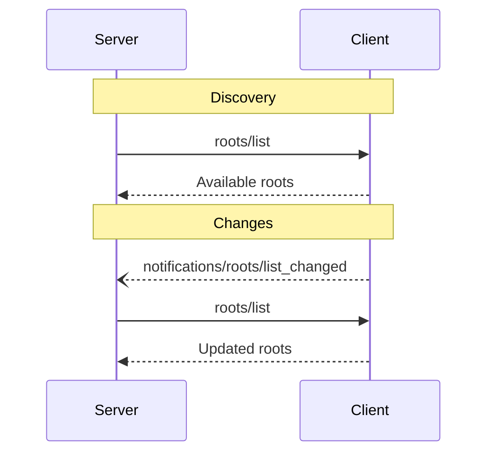

# 루트

<div id="enable-section-numbers" />

<Info>**프로토콜 개정**: 2025-11-25</Info>

Model Context Protocol (MCP)은 클라이언트가 파일 시스템 “루트”를 서버에 노출할 수 있는 표준화된 방법을 제공합니다. 루트는 서버가 파일 시스템 내에서 작업할 수 있는 경계를 정의하며, 서버가 접근 가능한 디렉터리와 파일을 이해하도록 돕습니다. 서버는 지원하는 클라이언트에게 루트 목록을 요청하고, 해당 목록이 변경될 때 알림을 받을 수 있습니다.

## 사용자 인터랙션 모델

MCP에서 루트는 일반적으로 작업공간 또는 프로젝트 설정 인터페이스를 통해 노출됩니다.

예를 들어, 구현체는 서버가 접근해야 할 디렉터리와 파일을 사용자가 선택할 수 있는 작업공간/프로젝트 선택기를 제공할 수 있습니다. 이는 버전 관리 시스템이나 프로젝트 파일로부터 자동 작업공간 감지와 결합될 수 있습니다.

하지만 구현체는 필요에 맞는 어떤 인터페이스 패턴을 사용해도 되며, 프로토콜 자체가 특정 사용자 인터랙션 모델을 강제하지 않습니다.

## 기능

루트를 지원하는 클라이언트는 `roots` 기능을 [initialization](/specification/2025-11-25/basic/lifecycle#initialization) 중에 **MUST** 선언해야 합니다:

```json  theme={null}
{
  "capabilities": {
    "roots": {
      "listChanged": true
    }
  }
}
```

`listChanged`은 루트 목록이 변경될 때 클라이언트가 알림을 전송할지 여부를 나타냅니다.

## 프로토콜 메시지

### 루트 목록 조회

루트를 가져오기 위해 서버는 `roots/list` 요청을 보냅니다:

**요청:**

```json  theme={null}
{
  "jsonrpc": "2.0",
  "id": 1,
  "method": "roots/list"
}
```

**응답:**

```json  theme={null}
{
  "jsonrpc": "2.0",
  "id": 1,
  "result": {
    "roots": [
      {
        "uri": "file:///home/user/projects/myproject",
        "name": "My Project"
      }
    ]
  }
}
```

### 루트 목록 변경

루트가 변경될 경우, `listChanged`를 지원하는 클라이언트는 **MUST** 알림을 전송해야 합니다:

```json  theme={null}
{
  "jsonrpc": "2.0",
  "method": "notifications/roots/list_changed"
}
```

## 메시지 흐름



## 데이터 타입

### 루트

루트 정의에는 다음이 포함됩니다:

* `uri`: 루트의 고유 식별자. 현재 사양에서는 `file://` URI이어야 **MUST** 합니다.
* `name`: 표시용 선택적인 인간 친화적 이름.

다양한 사용 사례에 대한 예시 루트:

#### 프로젝트 디렉터리

```json  theme={null}
{
  "uri": "file:///home/user/projects/myproject",
  "name": "My Project"
}
```

#### 다중 저장소

```json  theme={null}
[
  {
    "uri": "file:///home/user/repos/frontend",
    "name": "Frontend Repository"
  },
  {
    "uri": "file:///home/user/repos/backend",
    "name": "Backend Repository"
  }
]
```

## 오류 처리

클라이언트는 일반적인 실패 사례에 대해 표준 JSON-RPC 오류를 **SHOULD** 반환합니다:

* 클라이언트가 루트를 지원하지 않음: `-32601` (메서드 찾을 수 없음)
* 내부 오류: `-32603`

예시 오류:

```json  theme={null}
{
  "jsonrpc": "2.0",
  "id": 1,
  "error": {
    "code": -32601,
    "message": "Roots not supported",
    "data": {
      "reason": "Client does not have roots capability"
    }
  }
}
```

## 보안 고려 사항

1. 클라이언트는 **MUST**:
   * 적절한 권한이 있는 루트만 노출
   * 경로 탐색을 방지하기 위해 모든 루트 URI 검증
   * 적절한 접근 제어 구현
   * 루트 접근성을 모니터링

2. 서버는 **SHOULD**:
   * 루트가 사용 불가능해지는 경우 처리
   * 작업 중 루트 경계를 준수
   * 제공된 루트에 대해 모든 경로 검증

## 구현 가이드라인

1. 클라이언트는 **SHOULD**:
   * 루트를 서버에 노출하기 전에 사용자 동의를 요청
   * 루트 관리를 위한 명확한 사용자 인터페이스 제공
   * 노출 전에 루트 접근성 검증
   * 루트 변경을 모니터링

2. 서버는 **SHOULD**:
   * 사용 전에 루트 기능 확인
   * 루트 목록 변경을 부드럽게 처리
   * 작업 중 루트 경계 준수
   * 루트 정보를 적절히 캐시


---

> 이 문서에서 탐색 및 기타 페이지를 찾으려면 다음 주소에서 llms.txt 파일을 가져오세요: https://modelcontextprotocol.io/llms.txt