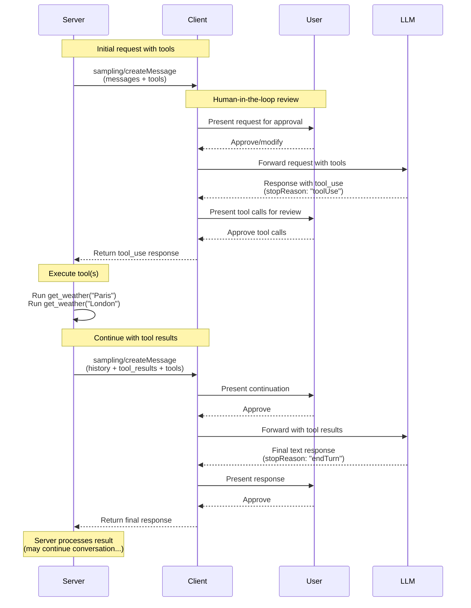
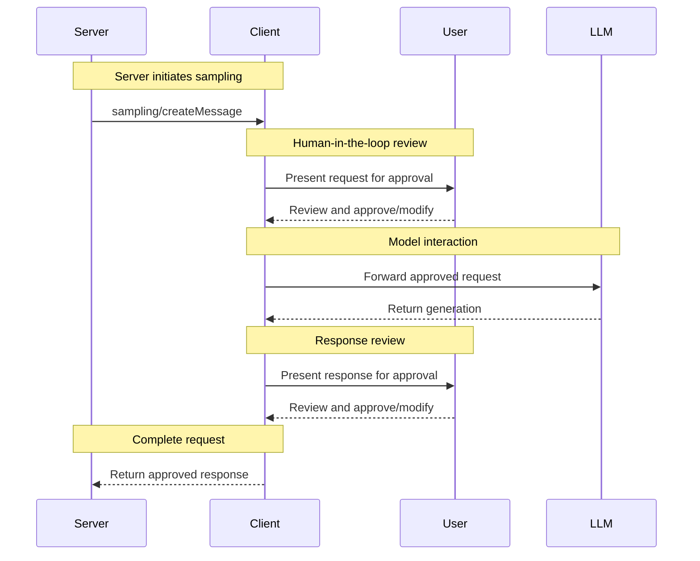

# Sampling

<div id="enable-section-numbers" />

<Info>**Protocol Revision**: 2025-11-25</Info>

Model Context Protocol (MCP)은 서버가 클라이언트를 통해 LLM 샘플링(“completions” 또는 “generations”)을 요청할 수 있는 표준화된 방식을 제공합니다. 이 흐름을 통해 클라이언트는 모델 접근, 선택 및 권한을 제어하면서 서버는 AI 기능을 활용할 수 있습니다—서버 API 키가 필요하지 않습니다. 서버는 텍스트, 오디오, 이미지 기반 상호작용을 요청할 수 있으며, 필요에 따라 프롬프트에 MCP 서버의 컨텍스트를 포함할 수 있습니다.

## User Interaction Model

MCP의 샘플링은 서버가 다른 MCP 서버 기능 내부에 *중첩*된 LLM 호출을 가능하게 함으로써 에이전시 행동을 구현할 수 있게 합니다.

구현자는 필요에 맞는 어떤 인터페이스 패턴으로도 샘플링을 노출할 수 있으며, 프로토콜 자체가 특정 사용자 인터랙션 모델을 강제하지 않습니다.

<Warning>
  신뢰·안전·보안을 위해 **항상** 샘플링 요청을 거부할 수 있는 인간이 개입해야 **합니다**.

  애플리케이션은 **다음과 같이 해야 합니다**:

  * 샘플링 요청을 쉽게 검토하고 직관적으로 확인할 수 있는 UI 제공
  * 사용자가 프롬프트를 전송 전에 확인·수정할 수 있도록 함
  * 생성된 응답을 전달 전에 검토할 수 있게 표시
</Warning>

## Tools in Sampling

서버는 `tools` 배열과 선택적 `toolChoice` 구성을 샘플링 요청에 포함시켜 클라이언트의 LLM이 도구를 사용하도록 요청할 수 있습니다. 이를 통해 서버는 LLM이 도구를 호출하고 결과를 받아 대화를 이어가는 에이전시 행동을 단일 샘플링 요청 흐름 내에서 구현할 수 있습니다.

클라이언트는 `sampling.tools` 기능을 선언하여 도구 사용이 가능한 샘플링 요청을 받을 수 **있어야 합니다**. 서버는 `sampling.tools` 기능을 선언하지 않은 클라이언트에게 도구 사용이 가능한 샘플링 요청을 **보내서는 안 됩니다**.

## Capabilities

샘플링을 지원하는 클라이언트는 [initialization](/specification/2025-11-25/basic/lifecycle#initialization) 중에 `sampling` 기능을 선언 **해야 합니다**:

**기본 샘플링:**

```json  theme={null}
{
  "capabilities": {
    "sampling": {}
  }
}
```

**도구 사용 지원 포함:**

```json  theme={null}
{
  "capabilities": {
    "sampling": {
      "tools": {}
    }
  }
}
```

**컨텍스트 포함 지원 (soft-deprecated) 포함:**

```json  theme={null}
{
  "capabilities": {
    "sampling": {
      "context": {}
    }
  }
}
```

<Note>
  `includeContext` 파라미터 값 `"thisServer"` 및 `"allServers"`는 soft-deprecated입니다. 서버는 이러한 값을 **사용하지 않아야 합니다**(예: 기본값인 `"none"`이므로 `includeContext`을 생략할 수 있음). 클라이언트가 `sampling.context` 기능을 선언한 경우를 제외하고는 **절대 사용해서는 안 됩니다**. 향후 사양 릴리스에서 이 값들은 제거될 수 있습니다.
</Note>

## Protocol Messages

### Creating Messages

언어 모델 생성을 요청하려면 서버가 `sampling/createMessage` 요청을 보냅니다:

**Request:**

```json  theme={null}
{
  "jsonrpc": "2.0",
  "id": 1,
  "method": "sampling/createMessage",
  "params": {
    "messages": [
      {
        "role": "user",
        "content": {
          "type": "text",
          "text": "What is the capital of France?"
        }
      }
    ],
    "modelPreferences": {
      "hints": [
        {
          "name": "claude-3-sonnet"
        }
      ],
      "intelligencePriority": 0.8,
      "speedPriority": 0.5
    },
    "systemPrompt": "You are a helpful assistant.",
    "maxTokens": 100
  }
}
```

**Response:**

```json  theme={null}
{
  "jsonrpc": "2.0",
  "id": 1,
  "result": {
    "role": "assistant",
    "content": {
      "type": "text",
      "text": "The capital of France is Paris."
    },
    "model": "claude-3-sonnet-20240307",
    "stopReason": "endTurn"
  }
}
```

### Sampling with Tools

다음 다이어그램은 도구와 함께하는 샘플링 전체 흐름을 보여주며, 다중 턴 도구 루프를 포함합니다:



도구 사용 기능이 포함된 LLM 생성을 요청하려면 서버는 요청에 `tools`와 선택적으로 `toolChoice`을 포함합니다:

**Request (Server → Client):**

```json  theme={null}
{
  "jsonrpc": "2.0",
  "id": 1,
  "method": "sampling/createMessage",
  "params": {
    "messages": [
      {
        "role": "user",
        "content": {
          "type": "text",
          "text": "What's the weather like in Paris and London?"
        }
      }
    ],
    "tools": [
      {
        "name": "get_weather",
        "description": "Get current weather for a city",
        "inputSchema": {
          "type": "object",
          "properties": {
            "city": {
              "type": "string",
              "description": "City name"
            }
          },
          "required": ["city"]
        }
      }
    ],
    "toolChoice": {
      "mode": "auto"
    },
    "maxTokens": 1000
  }
}
```

**Response (Client → Server):**

```json  theme={null}
{
  "jsonrpc": "2.0",
  "id": 1,
  "result": {
    "role": "assistant",
    "content": [
      {
        "type": "tool_use",
        "id": "call_abc123",
        "name": "get_weather",
        "input": {
          "city": "Paris"
        }
      },
      {
        "type": "tool_use",
        "id": "call_def456",
        "name": "get_weather",
        "input": {
          "city": "London"
        }
      }
    ],
    "model": "claude-3-sonnet-20240307",
    "stopReason": "toolUse"
  }
}
```

### Multi-turn Tool Loop

LLM으로부터 도구 사용 요청을 받은 후 서버는 일반적으로:

1. 요청된 도구 사용을 실행합니다.
2. 도구 결과를 추가한 새로운 샘플링 요청을 보냅니다.
3. LLM의 응답을 받습니다(새로운 도구 사용이 포함될 수 있음).
4. 필요에 따라 반복합니다(서버가 최대 반복 횟수를 제한하고, 마지막 반복에서 `toolChoice: {mode: "none"}`를 전달해 최종 결과를 강제할 수 있음).

**Follow‑up request (Server → Client) with tool results:**

```json  theme={null}
{
  "jsonrpc": "2.0",
  "id": 2,
  "method": "sampling/createMessage",
  "params": {
    "messages": [
      {
        "role": "user",
        "content": {
          "type": "text",
          "text": "What's the weather like in Paris and London?"
        }
      },
      {
        "role": "assistant",
        "content": [
          {
            "type": "tool_use",
            "id": "call_abc123",
            "name": "get_weather",
            "input": { "city": "Paris" }
          },
          {
            "type": "tool_use",
            "id": "call_def456",
            "name": "get_weather",
            "input": { "city": "London" }
          }
        ]
      },
      {
        "role": "user",
        "content": [
          {
            "type": "tool_result",
            "toolUseId": "call_abc123",
            "content": [
              {
                "type": "text",
                "text": "Weather in Paris: 18°C, partly cloudy"
              }
            ]
          },
          {
            "type": "tool_result",
            "toolUseId": "call_def456",
            "content": [
              {
                "type": "text",
                "text": "Weather in London: 15°C, rainy"
              }
            ]
          }
        ]
      }
    ],
    "tools": [
      {
        "name": "get_weather",
        "description": "Get current weather for a city",
        "inputSchema": {
          "type": "object",
          "properties": {
            "city": { "type": "string" }
          },
          "required": ["city"]
        }
      }
    ],
    "maxTokens": 1000
  }
}
```

**Final response (Client → Server):**

```json  theme={null}
{
  "jsonrpc": "2.0",
  "id": 2,
  "result": {
    "role": "assistant",
    "content": {
      "type": "text",
      "text": "Based on the current weather data:\n\n- **Paris**: 18°C and partly cloudy - quite pleasant!\n- **London**: 15°C and rainy - you'll want an umbrella.\n\nParis has slightly warmer and drier conditions today."
    },
    "model": "claude-3-sonnet-20240307",
    "stopReason": "endTurn"
  }
}
```

## Message Content Constraints

### Tool Result Messages

사용자 메시지에 도구 결과(type: "tool_result")가 포함될 경우, **오직** 도구 결과만 포함해야 **합니다**. 동일 메시지에 텍스트, 이미지, 오디오 등 다른 콘텐츠 유형을 섞어서는 안 됩니다.

이 제약은 OpenAI의 “tool” 역할, Gemini의 “function” 역할 등 도구 결과 전용 역할을 사용하는 제공자 API와의 호환성을 보장합니다.

**Valid - single tool result:**

```json  theme={null}
{
  "role": "user",
  "content": {
    "type": "tool_result",
    "toolUseId": "call_123",
    "content": [{ "type": "text", "text": "Result data" }]
  }
}
```

**Valid - multiple tool results:**

```json  theme={null}
{
  "role": "user",
  "content": [
    {
      "type": "tool_result",
      "toolUseId": "call_123",
      "content": [{ "type": "text", "text": "Result 1" }]
    },
    {
      "type": "tool_result",
      "toolUseId": "call_456",
      "content": [{ "type": "text", "text": "Result 2" }]
    }
  ]
}
```

**Invalid - mixed content:**

```json  theme={null}
{
  "role": "user",
  "content": [
    {
      "type": "text",
      "text": "Here are the results:"
    },
    {
      "type": "tool_result",
      "toolUseId": "call_123",
      "content": [{ "type": "text", "text": "Result data" }]
    }
  ]
}
```

### Tool Use and Result Balance

샘플링에서 도구 사용을 할 때, `ToolUseContent` 블록을 포함하는 모든 assistant 메시지는 **반드시** `ToolResultContent` 블록만으로 구성된 사용자 메시지로 이어져야 하며, 각 도구 사용(`id: $id`) matched by a corresponding tool result (with `toolUseId: $id` 등)은 다른 메시지가 나오기 전에 해결되어야 합니다.

이 요구사항은 다음을 보장합니다:

* 도구 사용이 대화가 진행되기 전에 항상 해결됨
* 제공자 API가 여러 도구 사용을 동시에 처리하고 결과를 병렬로 가져올 수 있음
* 대화가 일관된 요청‑응답 패턴을 유지함

**예시 유효 시퀀스:**

1. User message: "What's the weather like in Paris and London?"
2. Assistant message: `ToolUseContent` (`id: "call_abc123", name: "get_weather", input: {city: "Paris"}`) + `ToolUseContent` (`id: "call_def456", name: "get_weather", input: {city: "London"}`)
3. User message: `ToolResultContent` (`toolUseId: "call_abc123", content: "18°C, partly cloudy"`) + `ToolResultContent` (`toolUseId: "call_def456", content: "15°C, rainy"`)
4. Assistant message: 두 도시의 날씨를 비교한 텍스트 응답

**Invalid sequence - missing tool result:**

1. User message: "What's the weather like in Paris and London?"
2. Assistant message: `ToolUseContent` (`id: "call_abc123", name: "get_weather", input: {city: "Paris"}`) + `ToolUseContent` (`id: "call_def456", name: "get_weather", input: {city: "London"}`)
3. User message: `ToolResultContent` (`toolUseId: "call_abc123", content: "18°C, partly cloudy"`) ← call_def456에 대한 결과 누락
4. Assistant message: 텍스트 응답 (invalid - 모든 도구 사용이 해결되지 않음)

## Cross-API Compatibility

샘플링 사양은 여러 LLM 제공자 API(Claude, OpenAI, Gemini 등)에서 동작하도록 설계되었습니다. 호환성을 위한 핵심 설계는 다음과 같습니다:

### Message Roles

MCP는 두 가지 역할을 사용합니다: “user”와 “assistant”.

도구 사용 요청은 CreateMessageResult에 “assistant” 역할로 전송됩니다.
도구 결과는 “user” 역할 메시지로 반환됩니다.
도구 결과가 포함된 메시지는 다른 종류의 콘텐츠를 포함할 수 없습니다.

### Tool Choice Modes

`CreateMessageRequest.params.toolChoice`은 모델의 도구 사용 가능성을 제어합니다:

* `{mode: "auto"}`: 모델이 도구 사용 여부를 스스로 결정(기본값)
* `{mode: "required"}`: 모델은 완료 전에 최소 하나의 도구를 반드시 사용해야 함
* `{mode: "none"}`: 모델은 절대 도구를 사용해서는 안 됨

### Parallel Tool Use

MCP는 모델이 동시에 여러 도구 사용 요청을 할 수 있도록 허용합니다(`ToolUseContent` 배열 반환). 주요 제공자 API 모두 이를 지원합니다:

* **Claude**: 기본적으로 병렬 도구 사용 지원
* **OpenAI**: 병렬 도구 호출 지원( `parallel_tool_calls: false` 로 비활성화 가능)
* **Gemini**: 기본적으로 병렬 함수 호출 지원

병렬 도구 사용 비활성화를 지원하는 제공자를 래핑하는 구현은 이를 확장 기능으로 노출할 수 있지만, 핵심 MCP 사양에는 포함되지 않습니다.

## Message Flow



## Data Types

### Messages

샘플링 메시지는 다음을 포함할 수 있습니다:

#### Text Content

```json  theme={null}
{
  "type": "text",
  "text": "The message content"
}
```

#### Image Content

```json  theme={null}
{
  "type": "image",
  "data": "base64-encoded-image-data",
  "mimeType": "image/jpeg"
}
```

#### Audio Content

```json  theme={null}
{
  "type": "audio",
  "data": "base64-encoded-audio-data",
  "mimeType": "audio/wav"
}
```

### Model Preferences

MCP에서 모델 선택은 서버와 클라이언트가 서로 다른 AI 제공자와 다양한 모델을 사용하기 때문에 신중한 추상이 필요합니다. 서버가 특정 모델 이름을 직접 요청할 수 없으며, 클라이언트가 해당 모델에 접근하지 못하거나 다른 제공자의 동등 모델을 선호할 수 있습니다.

이를 해결하기 위해 MCP는 추상화된 기능 우선순위와 선택적 모델 힌트를 결합한 선호 시스템을 구현합니다:

#### Capability Priorities

서버는 세 가지 정규화된 우선순위 값(0‑1)으로 요구를 표현합니다:

* `costPriority`: 비용 최소화 중요도 – 값이 클수록 저렴한 모델을 선호
* `speedPriority`: 낮은 지연 시간 중요도 – 값이 클수록 빠른 모델을 선호
* `intelligencePriority`: 고급 기능 중요도 – 값이 클수록 더 강력한 모델을 선호

#### Model Hints

우선순위가 특성 기반 모델 선택을 돕는 동안, `hints`은 서버가 특정 모델이나 모델군을 제안할 수 있게 합니다:

* 힌트는 모델 이름에 유연하게 매치될 수 있는 부분 문자열로 취급
* 여러 힌트는 선호 순서대로 평가
* 클라이언트는 **히int를** 다른 제공자의 동등 모델에 매핑할 **수 있습니다**
* 힌트는 권고 사항이며, 최종 모델 선택은 클라이언트가 수행

예시:

```json  theme={null}
{
  "hints": [
    { "name": "claude-3-sonnet" }, // Prefer Sonnet-class models
    { "name": "claude" } // Fall back to any Claude model
  ],
  "costPriority": 0.3, // Cost is less important
  "speedPriority": 0.8, // Speed is very important
  "intelligencePriority": 0.5 // Moderate capability needs
}
```

클라이언트는 이러한 선호도를 바탕으로 사용 가능한 옵션 중 적절한 모델을 선택합니다. 예를 들어, 클라이언트가 Claude 모델에 접근할 수 없고 Gemini만 있다면, sonnet 힌트를 `gemini-1.5-pro`에 매핑해 유사한 기능을 활용할 수 있습니다.

## Error Handling

클라이언트는 일반적인 실패 사례에 대해 오류를 반환 **해야 합니다**:

* 사용자가 샘플링 요청을 거부함: `-1`
* 요청에 도구 결과가 누락됨: `-32602` (Invalid params)
* 도구 결과가 다른 콘텐츠와 혼합됨: `-32602` (Invalid params)

오류 예시:

```json  theme={null}
{
  "jsonrpc": "2.0",
  "id": 3,
  "error": {
    "code": -1,
    "message": "User rejected sampling request"
  }
}
```

```json  theme={null}
{
  "jsonrpc": "2.0",
  "id": 4,
  "error": {
    "code": -32602,
    "message": "Tool result missing in request"
  }
}
```

## Security Considerations

1. 클라이언트는 사용자 승인 제어를 **구현해야 합니다**
2. 양측 모두 메시지 콘텐츠를 **검증해야 합니다**
3. 클라이언트는 모델 선호 힌트를 **존중해야 합니다**
4. 클라이언트는 **속도 제한**을 구현해야 합니다
5. 양측은 민감 데이터를 **적절히 처리**해야 합니다

도구가 샘플링에 사용될 경우 추가 보안 고려사항이 적용됩니다:

6. 서버는 `stopReason: "toolUse"`에 응답할 때, 각 `ToolUseContent` 항목이 일치하는 `toolUseId`을 가진 `ToolResultContent` 항목으로 응답되도록 **보장해야 하며**, 사용자 메시지는 도구 결과만 포함하고 다른 콘텐츠 유형은 포함하지 않아야 합니다.
7. 양측은 도구 루프에 대한 **반복 제한**을 **구현해야 합니다**


---

> 이 문서의 탐색 및 기타 페이지를 찾으려면 https://modelcontextprotocol.io/llms.txt 에서 llms.txt 파일을 가져오세요.