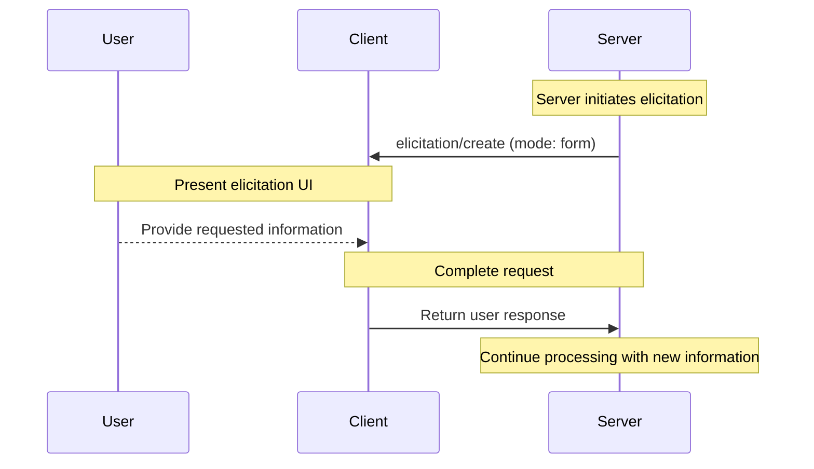
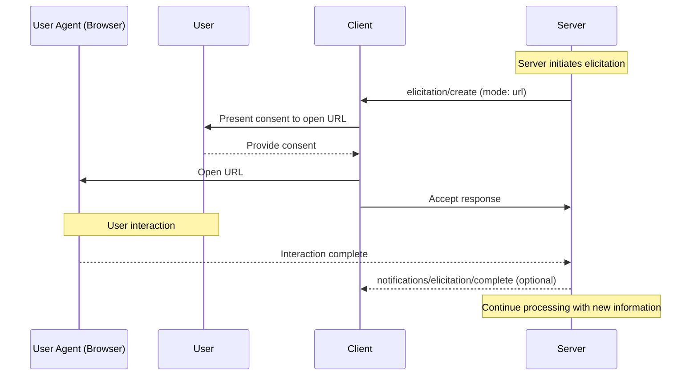
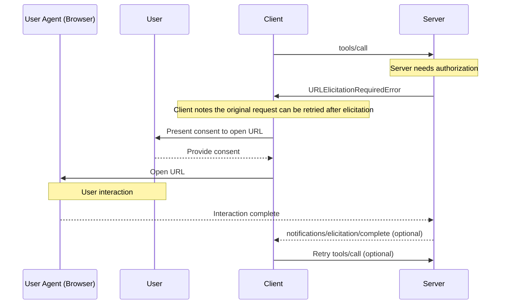
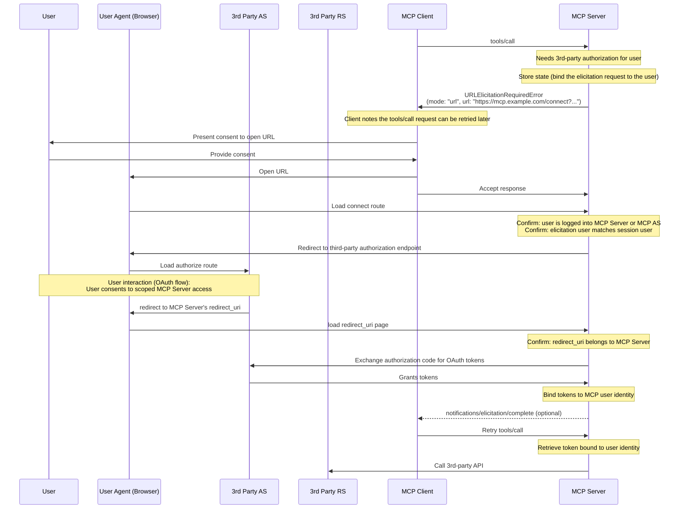

# Elicitation

<div id="enable-section-numbers" />

<Info>**프로토콜 개정**: 2025-11-25</Info>

Model Context Protocol (MCP)은 서버가 상호작용 중 클라이언트를 통해 사용자에게 추가 정보를 요청할 수 있는 표준화된 방법을 제공합니다. 이 흐름을 통해 클라이언트는 사용자 상호작용 및 데이터 공유에 대한 제어권을 유지하면서 서버는 필요한 정보를 동적으로 수집할 수 있습니다.

Elicitation은 두 가지 모드를 지원합니다:

* **Form mode**: 서버는 응답을 검증하기 위한 선택적 JSON 스키마와 함께 구조화된 데이터를 사용자에게 요청할 수 있습니다.
* **URL mode**: 서버는 민감한 상호작용을 위해 사용자를 외부 URL로 안내할 수 있으며, 이 경우 MCP 클라이언트를 통과해서는 안 됩니다.

## User Interaction Model

MCP에서의 Elicitation은 서버가 다른 MCP 서버 기능 내부에 *중첩*된 형태로 사용자 입력 요청을 구현할 수 있게 합니다.

구현자는 필요에 따라 어떤 인터페이스 패턴으로든 Elicitation을 노출할 수 있으며, 프로토콜 자체가 특정 사용자 상호작용 모델을 강제하지 않습니다.

<Warning>
  신뢰·안전 및 보안을 위해:

  * 서버는 **민감한 정보를 요청하기 위해 Form mode Elicitation을 사용해서는 안 됩니다**
  * 서버는 자격 증명 등 민감한 정보를 포함하는 상호작용에 **URL mode**를 사용해야 합니다

  MCP 클라이언트는 **다음 사항을 반드시 수행해야 합니다**:

  * 어떤 서버가 정보를 요청하는지 명확히 표시하는 UI 제공
  * 사용자 프라이버시를 존중하고 명확한 거부·취소 옵션 제공
  * Form mode의 경우, 전송 전에 사용자가 응답을 검토·수정할 수 있도록 함
  * URL mode의 경우, 대상 도메인/호스트를 명확히 표시하고 사용자의 동의를 얻은 후에만 URL로 이동
</Warning>

## Capabilities

Elicitation을 지원하는 클라이언트는 `elicitation` 기능을 [initialization](../basic/lifecycle#initialization) 시 선언해야 **합니다**:

```json  theme={null}
{
  "capabilities": {
    "elicitation": {
      "form": {},
      "url": {}
    }
  }
}
```

하위 호환성을 위해, 빈 capabilities 객체는 `form` 모드만 지원한다고 간주됩니다:

```jsonc  theme={null}
{
  "capabilities": {
    "elicitation": {}, // Equivalent to { "form": {} }
  },
}
```

`elicitation` 기능을 선언한 클라이언트는 최소 하나의 모드(`form` 또는 `url`)를 **지원해야 합니다**.

서버는 클라이언트가 지원하지 않는 모드의 Elicitation 요청을 **보내서는 안 됩니다**.

## Protocol Messages

### Elicitation Requests

사용자에게 정보를 요청하려면 서버는 `elicitation/create` 요청을 보냅니다.

모든 Elicitation 요청은 다음 매개변수를 **포함해야 합니다**:

| 이름 | 유형 | 옵션 | 설명 |
| --------- | ------ | ------------- | -------------------------------------------------------------------------------------- |
| `mode` | string | `form`, `url` | Elicitation의 모드. Form mode인 경우 선택 사항이며, 생략 시 기본값은 `"form"`입니다. |
| `message` | string |  | 상호작용이 필요한 이유를 설명하는 인간이 읽을 수 있는 메시지. |

`mode` 매개변수는 Elicitation 유형을 지정합니다:

* `"form"`: 선택적 스키마 검증이 가능한 인밴드 구조화 데이터 수집. 데이터가 클라이언트에 노출됩니다.
* `"url"`: URL 탐색을 통한 아웃오브밴드 상호작용. URL 자체를 제외한 데이터는 **클라이언트에 노출되지 않습니다**.

하위 호환성을 위해, 서버는 Form mode Elicitation 요청에서 `mode` 필드를 **생략할 수** 있습니다. 클라이언트는 `mode` 필드가 없는 요청을 Form mode로 **처리해야 합니다**.

### Form Mode Elicitation Requests

Form mode Elicitation은 서버가 MCP 클라이언트를 통해 직접 구조화된 데이터를 수집할 수 있게 합니다.

Form mode Elicitation 요청은 `mode: "form"`를 지정하거나 `mode` 필드를 생략해야 하며, 다음 추가 매개변수를 포함해야 합니다:

| 이름 | 유형 | 설명 |
| ----------------- | ------ | -------------------------------------------------------------- |
| `requestedSchema` | object | 기대되는 응답 구조를 정의하는 JSON Schema. |

#### Requested Schema

`requestedSchema` 매개변수를 사용하면 서버는 제한된 JSON Schema 하위 집합으로 기대 응답 구조를 정의할 수 있습니다.

클라이언트 사용자 경험을 단순화하기 위해, Form mode Elicitation 스키마는 원시 속성만을 갖는 평면 객체로 제한됩니다.

스키마는 다음 원시 타입만 허용합니다:

1. **String Schema**

   ```json  theme={null}
   {
     "type": "string",
     "title": "Display Name",
     "description": "Description text",
     "minLength": 3,
     "maxLength": 50,
     "pattern": "^[A-Za-z]+$",
     "format": "email",
     "default": "user@example.com"
   }
   ```

   지원 포맷: `email`, `uri`, `date`, `date-time`

2. **Number Schema**

   ```json  theme={null}
   {
     "type": "number", // or "integer"
     "title": "Display Name",
     "description": "Description text",
     "minimum": 0,
     "maximum": 100,
     "default": 50
   }
   ```

3. **Boolean Schema**

   ```json  theme={null}
   {
     "type": "boolean",
     "title": "Display Name",
     "description": "Description text",
     "default": false
   }
   ```

4. **Enum Schema**

   타이틀이 없는 단일 선택 enum:

   ```json  theme={null}
   {
     "type": "string",
     "title": "Color Selection",
     "description": "Choose your favorite color",
     "enum": ["Red", "Green", "Blue"],
     "default": "Red"
   }
   ```

   타이틀이 있는 단일 선택 enum:

   ```json  theme={null}
   {
     "type": "string",
     "title": "Color Selection",
     "description": "Choose your favorite color",
     "oneOf": [
       { "const": "#FF0000", "title": "Red" },
       { "const": "#00FF00", "title": "Green" },
       { "const": "#0000FF", "title": "Blue" }
     ],
     "default": "#FF0000"
   }
   ```

   타이틀이 없는 다중 선택 enum:

   ```json  theme={null}
   {
     "type": "array",
     "title": "Color Selection",
     "description": "Choose your favorite colors",
     "minItems": 1,
     "maxItems": 2,
     "items": {
       "type": "string",
       "enum": ["Red", "Green", "Blue"]
     },
     "default": ["Red", "Green"]
   }
   ```

   타이틀이 있는 다중 선택 enum:

   ```json  theme={null}
   {
     "type": "array",
     "title": "Color Selection",
     "description": "Choose your favorite colors",
     "minItems": 1,
     "maxItems": 2,
     "items": {
       "anyOf": [
         { "const": "#FF0000", "title": "Red" },
         { "const": "#00FF00", "title": "Green" },
         { "const": "#0000FF", "title": "Blue" }
       ]
     },
     "default": ["#FF0000", "#00FF00"]
   }
   ```

클라이언트는 이 스키마를 사용하여:

1. 적절한 입력 폼 생성
2. 전송 전 사용자 입력 검증
3. 사용자에게 더 나은 안내 제공

모든 원시 타입은 선택적 기본값을 지원하여 합리적인 시작점을 제공합니다. 기본값을 지원하는 클라이언트는 해당 값을 사전에 폼 필드에 채워 넣어야 **합니다**.

복잡한 중첩 구조, 객체 배열(열거형을 제외한) 및 기타 고급 JSON Schema 기능은 클라이언트 사용자 경험을 단순화하기 위해 의도적으로 지원되지 않습니다.

#### Example: Simple Text Request

**Request:**

```json  theme={null}
{
  "jsonrpc": "2.0",
  "id": 1,
  "method": "elicitation/create",
  "params": {
    "mode": "form",
    "message": "Please provide your GitHub username",
    "requestedSchema": {
      "type": "object",
      "properties": {
        "name": {
          "type": "string"
        }
      },
      "required": ["name"]
    }
  }
}
```

**Response:**

```json  theme={null}
{
  "jsonrpc": "2.0",
  "id": 1,
  "result": {
    "action": "accept",
    "content": {
      "name": "octocat"
    }
  }
}
```

#### Example: Structured Data Request

**Request:**

```json  theme={null}
{
  "jsonrpc": "2.0",
  "id": 2,
  "method": "elicitation/create",
  "params": {
    "mode": "form",
    "message": "Please provide your contact information",
    "requestedSchema": {
      "type": "object",
      "properties": {
        "name": {
          "type": "string",
          "description": "Your full name"
        },
        "email": {
          "type": "string",
          "format": "email",
          "description": "Your email address"
        },
        "age": {
          "type": "number",
          "minimum": 18,
          "description": "Your age"
        }
      },
      "required": ["name", "email"]
    }
  }
}
```

**Response:**

```json  theme={null}
{
  "jsonrpc": "2.0",
  "id": 2,
  "result": {
    "action": "accept",
    "content": {
      "name": "Monalisa Octocat",
      "email": "octocat@github.com",
      "age": 30
    }
  }
}
```

### URL Mode Elicitation Requests

<Note>
  **새 기능:** URL mode Elicitation은 MCP 사양의 `2025-11-25` 버전에서 도입되었습니다. 향후 프로토콜 개정 시 설계·구현이 변경될 수 있습니다.
</Note>

URL mode Elicitation은 서버가 사용자를 외부 URL로 안내하여 MCP 클라이언트를 통과하지 않아야 하는 아웃오브밴드 상호작용을 수행하도록 합니다. 이는 인증 흐름, 결제 처리 및 기타 민감하거나 보안이 요구되는 작업에 필수적입니다.

URL mode Elicitation 요청은 `mode: "url"`와 `message`를 **지정**하고, 다음 추가 매개변수를 포함해야 합니다:

| 이름 | 유형 | 설명 |
| --------------- | ------ | ----------------------------------------- |
| `url` | string | 사용자가 탐색해야 할 URL. |
| `elicitationId` | string | Elicitation을 식별하는 고유 ID. |

`url` 매개변수는 **유효한 URL**을 포함해야 합니다.

<Note>
  **중요**: URL mode Elicitation은 MCP 클라이언트가 MCP 서버에 접근하도록 **인증**하는 용도가 아닙니다([MCP
  authorization](../basic/authorization)에서 처리). 대신, MCP 서버가 사용자 대신 민감한 정보나 제3자 인증을 얻어야 할 때 사용됩니다. MCP 클라이언트의 베어러 토큰은 변경되지 않으며, 클라이언트는 사용자가 열어야 할 URL에 대한 컨텍스트만 제공하면 됩니다.
</Note>

#### Example: Request Sensitive Data

이 예시는 사용자를 보안 URL로 안내하여 민감한 정보를 제공하도록 하는 URL mode Elicitation 요청을 보여줍니다(예: API 키). 동일한 요청을 OAuth 인증 흐름이나 결제 흐름에 사용할 수도 있습니다. 차이는 URL과 메시지뿐입니다.

**Request:**

```json  theme={null}
{
  "jsonrpc": "2.0",
  "id": 3,
  "method": "elicitation/create",
  "params": {
    "mode": "url",
    "elicitationId": "550e8400-e29b-41d4-a716-446655440000",
    "url": "https://mcp.example.com/ui/set_api_key",
    "message": "Please provide your API key to continue."
  }
}
```

**Response:**

```json  theme={null}
{
  "jsonrpc": "2.0",
  "id": 3,
  "result": {
    "action": "accept"
  }
}
```

`action: "accept"`이 포함된 응답은 사용자가 상호작용에 **동의**했음을 나타냅니다. 이는 상호작용이 완료되었다는 의미는 아니며, 아웃오브밴드로 진행되므로 클라이언트는 서버가 완료 알림을 보낼 때까지 결과를 알 수 없습니다.

### Completion Notifications for URL Mode Elicitation

서버는 URL mode Elicitation으로 시작된 아웃오브밴드 상호작용이 완료되면 `notifications/elicitation/complete` 알림을 **보낼 수** 있습니다. 이를 통해 클라이언트는 필요 시 프로그래밍적으로 반응할 수 있습니다.

알림을 보내는 서버는:

* **시작한 클라이언트에게만** 알림을 전송해야 합니다.
* 원래 `elicitation/create` 요청에서 설정한 `elicitationId`를 포함해야 합니다.

클라이언트는:

* 알 수 없거나 이미 완료된 ID에 대한 알림은 **무시**해야 합니다.
* [URLElicitationRequiredError](#error-handling)을 받은 요청을 자동으로 재시도하거나 UI를 업데이트하는 등 알림을 **대기**할 수 있습니다.
* 알림이 도착하지 않을 경우 사용자가 원래 요청을 재시도하거나 취소할 수 있는 수동 제어를 **제공**해야 합니다.

#### Example

```json  theme={null}
{
  "jsonrpc": "2.0",
  "method": "notifications/elicitation/complete",
  "params": {
    "elicitationId": "550e8400-e29b-41d4-a716-446655440000"
  }
}
```

### URL Elicitation Required Error

요청을 처리하려면 Elicitation이 완료되어야 하는 경우, 서버는 [`URLElicitationRequiredError`](#error-handling)(코드 `-32042`)를 **반환**하여 클라이언트에 URL mode Elicitation이 필요함을 알릴 수 있습니다. 서버는 URL mode Elicitation이 필요할 때만 이 오류를 **반환해야** 합니다.

오류에는 원래 요청을 재시도하기 전에 완료해야 할 Elicitation 목록이 포함되어야 합니다.

오류에 포함된 모든 Elicitation은 URL mode이어야 하며 `elicitationId` 속성을 가져야 합니다.

**Error Response:**

```json  theme={null}
{
  "jsonrpc": "2.0",
  "id": 2,
  "error": {
    "code": -32042, // URL_ELICITATION_REQUIRED
    "message": "This request requires more information.",
    "data": {
      "elicitations": [
        {
          "mode": "url",
          "elicitationId": "550e8400-e29b-41d4-a716-446655440000",
          "url": "https://mcp.example.com/connect?elicitationId=550e8400-e29b-41d4-a716-446655440000",
          "message": "Authorization is required to access your Example Co files."
        }
      ]
    }
  }
}
```

## Message Flow

### Form Mode Flow



### URL Mode Flow



### URL Mode With Elicitation Required Error Flow



## Response Actions

Elicitation 응답은 세 가지 행동 모델을 사용하여 서로 다른 사용자 행동을 명확히 구분합니다. 이 행동은 Form 및 URL 두 모드 모두에 적용됩니다.

```json  theme={null}
{
  "jsonrpc": "2.0",
  "id": 1,
  "result": {
    "action": "accept", // or "decline" or "cancel"
    "content": {
      "propertyName": "value",
      "anotherProperty": 42
    }
  }
}
```

세 가지 응답 행동은 다음과 같습니다:

1. **Accept** (`action: "accept"`): 사용자가 명시적으로 승인하고 데이터를 제출함
   * Form mode: `content` 필드에 요청된 스키마와 일치하는 제출 데이터가 포함됩니다.
   * URL mode: `content` 필드는 생략됩니다.
   * 예시: 사용자가 "Submit", "OK", "Confirm" 등을 클릭함.

2. **Decline** (`action: "decline"`): User explicitly declined the request
   * The `content` field is typically omitted
   * Example: User clicked "Reject", "Decline", "No", etc.

3. **Cancel** (`action: "cancel"`): User dismissed without making an explicit choice
   * The `content` field is typically omitted
   * Example: User closed the dialog, clicked outside, pressed Escape, browser failed to load, etc.

Servers should handle each state appropriately:

* **Accept**: Process the submitted data
* **Decline**: Handle explicit decline (e.g., offer alternatives)
* **Cancel**: Handle dismissal (e.g., prompt again later)

## Implementation Considerations

### Statefulness

Most practical uses of elicitation require that the server maintain state about users:

* Whether required information has been collected (e.g., the user's display name via form mode elicitation)
* Status of resource access (e.g., API keys or a payment flow via URL mode elicitation)

Servers implementing elicitation **MUST** securely associate this state with individual users following the guidelines in the [security best practices](../basic/security_best_practices) document. Specifically:

* State **MUST NOT** be associated with session IDs alone
* State storage **MUST** be protected against unauthorized access
* For remote MCP servers, user identification **MUST** be derived from credentials acquired via [MCP authorization](../basic/authorization) when possible (e.g. `sub` claim)

<Note>
  The examples in this section are non-normative and illustrate potential uses
  of elicitation. Implementers should adapt these patterns to their specific
  requirements while maintaining security best practices.
</Note>

### URL Mode Elicitation for Sensitive Data

For servers that interact with external APIs requiring sensitive information (e.g., credentials, payment information), URL mode elicitation provides a secure mechanism for users to provide this information without exposing it to the MCP client.

In this pattern:

1. The server directs users to a secure web page (served over HTTPS)
2. The page presents a branded form UI on a domain the user trusts
3. Users enter sensitive credentials directly into the secure form
4. The server stores credentials securely, bound to the user's identity
5. Subsequent MCP requests use these stored credentials for API access

This approach ensures that sensitive credentials never pass through the LLM context, MCP client or any intermediate MCP servers, reducing the risk of exposure through client-side logging or other attack vectors.

### URL Mode Elicitation for OAuth Flows

URL mode elicitation enables a pattern where MCP servers act as OAuth clients to third-party resource servers.
Authorization with external APIs enabled by URL mode elicitation is separate from [MCP authorization](../basic/authorization). MCP servers **MUST NOT** rely on URL mode elicitation to authorize users for themselves.

#### Understanding the Distinction

* **MCP Authorization**: Required OAuth flow between the MCP client and MCP server (covered in the [authorization specification](../basic/authorization))
* **External (third-party) Authorization**: Optional authorization between the MCP server and a third-party resource server, initiated via URL mode elicitation

In external authorization, the server acts as both:

* An OAuth resource server (to the MCP client)
* An OAuth client (to the third-party resource server)

Example scenario:

* An MCP client connects to an MCP server
* The MCP server integrates with various different third-party services
* When the MCP client calls a tool that requires access to a third-party service, the MCP server needs credentials for that service

The critical security requirements are:

1. **The third-party credentials MUST NOT transit through the MCP client**: The client must never see third-party credentials to protect the security boundary
2. **The MCP server MUST NOT use the client's credentials for the third-party service**: That would be [token passthrough](../basic/security_best_practices#token-passthrough), which is forbidden
3. **The user MUST authorize the MCP server directly**: The interaction happens outside the MCP protocol, without involving the MCP client
4. **The MCP server is responsible for tokens**: The MCP server is responsible for storing and managing the third-party tokens obtained through the URL mode elicitation (in other words, the MCP server must be stateful).

Credentials obtained via URL mode elicitation are distinct from the MCP server credentials used by the MCP client. The MCP server **MUST NOT** transmit credentials obtained through URL mode elicitation to the MCP client.

<Note>
  For additional background, refer to the [token passthrough
  section](../basic/security_best_practices#token-passthrough) of the Security
  Best Practices document to understand why MCP servers cannot act as
  pass-through proxies.
</Note>

#### Implementation Pattern

When implementing external authorization via URL mode elicitation:

1. The MCP server generates an authorization URL, acting as an OAuth client to the third-party service
2. The MCP server stores internal state that associates (binds) the elicitation request with the user's identity.
3. The MCP server sends a URL mode elicitation request to the client with a URL that can start the authorization flow.
4. The user completes the OAuth flow directly with the third-party authorization server
5. The third-party authorization server redirects back to the MCP server
6. The MCP server securely stores the third-party tokens, bound to the user's identity
7. Future MCP requests can leverage these stored tokens for API access to the third-party resource server

The following is a non-normative example of how this pattern could be implemented:



This pattern maintains clear security boundaries while enabling rich integrations with third-party services that require user authorization.

## Error Handling

Servers **MUST** return standard JSON-RPC errors for common failure cases:

* When a request cannot be processed until an elicitation is completed: `-32042` (`URLElicitationRequiredError`)

Clients **MUST** return standard JSON-RPC errors for common failure cases:

* Server sends an `elicitation/create` request with a mode not declared in client capabilities: `-32602` (Invalid params)

## Security Considerations

1. Servers **MUST** bind elicitation requests to the client and user identity
2. Clients **MUST** provide clear indication of which server is requesting information
3. Clients **SHOULD** implement user approval controls
4. Clients **SHOULD** allow users to decline elicitation requests at any time
5. Clients **SHOULD** implement rate limiting
6. Clients **SHOULD** present elicitation requests in a way that makes it clear what information is being requested and why

### Safe URL Handling

MCP servers requesting elicitation:

1. **MUST NOT** include sensitive information about the end-user, including credentials, personal identifiable information, etc., in the URL sent to the client in a URL elicitation request.
2. **MUST NOT** provide a URL which is pre-authenticated to access a protected resource, as the URL could be used to impersonate the user by a malicious client.
3. **SHOULD NOT** include URLs intended to be clickable in any field of a form mode elicitation request.
4. **SHOULD** use HTTPS URLs for non-development environments.

These server requirements ensure that client implementations have clear rules about when to present a URL to the user, so that the client-side rules (below) can be consistently applied.

Clients implementing URL mode elicitation **MUST** handle URLs carefully to prevent users from unknowingly clicking malicious links.

When handling URL mode elicitation requests, MCP clients:

1. **MUST NOT** automatically pre-fetch the URL or any of its metadata.
2. **MUST NOT** open the URL without explicit consent from the user.
3. **MUST** show the full URL to the user for examination before consent.
4. **MUST** open the URL provided by the server in a secure manner that does not enable the client or LLM to inspect the content or user inputs.
   For example, on iOS, [SFSafariViewController](https://developer.apple.com/documentation/safariservices/sfsafariviewcontroller) is good, but [WkWebView](https://developer.apple.com/documentation/webkit/wkwebview) is not.
5. **SHOULD** highlight the domain of the URL to mitigate subdomain spoofing.
6. **SHOULD** have warnings for ambiguous/suspicious URIs (i.e., containing Punycode).
7. **SHOULD NOT** render URLs as clickable in any field of an elicitation request, except for the `url` field in a URL elicitation request (with the restrictions detailed above).

### Identifying the User

Servers **MUST NOT** rely on client-provided user identification without server verification, as this can be forged.
Instead, servers **SHOULD** follow [security best practices](../basic/security_best_practices).

Non-normative examples:

* Incorrect: Treat user input like "I am [joe@example.com](mailto:joe@example.com)" as authoritative
* Correct: Rely on [authorization](../basic/authorization) to identify the user

### Form Mode Security

1. Servers **MUST NOT** request sensitive information (passwords, API keys, etc.) via form mode
2. Clients **SHOULD** validate all responses against the provided schema
3. Servers **SHOULD** validate received data matches the requested schema

#### Phishing

URL mode elicitation returns a URL that an attacker can use to send to a victim. The MCP Server **MUST** verify the identity of the user who opens the URL before accepting information.

Typically identity verification is done by leveraging the [MCP authorization server](../basic/authorization) to identify the user, through a session cookie or equivalent in the browser.

For example, URL mode elicitation may be used to perform OAuth flows where the server acts as an OAuth client of another resource server. Without proper mitigation, the following phishing attack is possible:

1. A malicious user (Alice) connected to a benign server triggers an elicitation request
2. The benign server generates an authorization URL, acting as an OAuth client of a third-party authorization server
3. Alice's client displays the URL and asks for consent
4. Instead of clicking on the link, Alice tricks a victim user (Bob) of the same benign server into clicking it
5. Bob opens the link and completes the authorization, thinking they are authorizing their own connection to the benign server
6. The benign server receives a callback/redirect form the third-party authorization server, and assumes it's Alice's request
7. The tokens for the third-party server are bound to Alice's session and identity, instead of Bob's, resulting in an account takeover

이 공격을 방지하기 위해 서버는 **MUST** 요청을 시작한 사용자( MCP 클라이언트를 통해 서버에 접근하는 최종 사용자)가 권한 부여 흐름을 완료하는 동일한 사용자임을 보장해야 합니다.

이를 달성하는 방법은 여러 가지가 있으며 최적의 방법은 구체적인 구현에 따라 달라집니다.

일반적인 비규범적 예로, MCP 서버가 웹을 통해 접근 가능하고 제3자 권한 부여 코드 흐름을 수행하려는 경우를 고려해 보겠습니다. 피싱 공격을 방지하기 위해 서버는 제3자 권한 부여 엔드포인트 대신 `https://mcp.example.com/connect?elicitationId=...` 로 URL 모드 요청을 생성합니다. 이 “연결 URL”은 페이지를 연 사용자가 요청을 생성한 사용자와 동일한지 확인해야 합니다. 예를 들어, 사용자가 유효한 세션 쿠키를 가지고 있는지, 그리고 그 세션 쿠키가 MCP 클라이언트를 사용해 URL 모드 요청을 생성한 동일한 사용자를 위한 것인지 확인할 수 있습니다. 이는 MCP 서버의 인증 서버에서 제공하는 권한 주체(`sub` 클레임)와 세션 쿠키의 주체를 비교함으로써 수행될 수 있습니다. 해당 페이지가 동일한 사용자를 확인하면, 사용자를 `https://example.com/authorize?...` 에 있는 제3자 인증 서버로 보내 정상적인 OAuth 흐름을 완료할 수 있습니다.

다른 경우에는 서버가 웹을 통해 접근할 수 없으며 세션 쿠키를 사용해 사용자를 식별할 수 없을 수도 있습니다. 이 경우 서버는 요청 URL을 연 사용자가 요청을 생성한 사용자와 동일한지를 확인하기 위한 다른 메커니즘을 사용해야 합니다.

모든 구현에서 서버는 **MUST** 사용자의 신원을 판단하는 메커니즘이 공격자가 요청 URL을 변조할 수 있는 공격에 견고하도록 보장해야 합니다.

---

> 이 문서에서 탐색 및 기타 페이지를 찾으려면 다음 주소에서 llms.txt 파일을 가져오세요: https://modelcontextprotocol.io/llms.txt