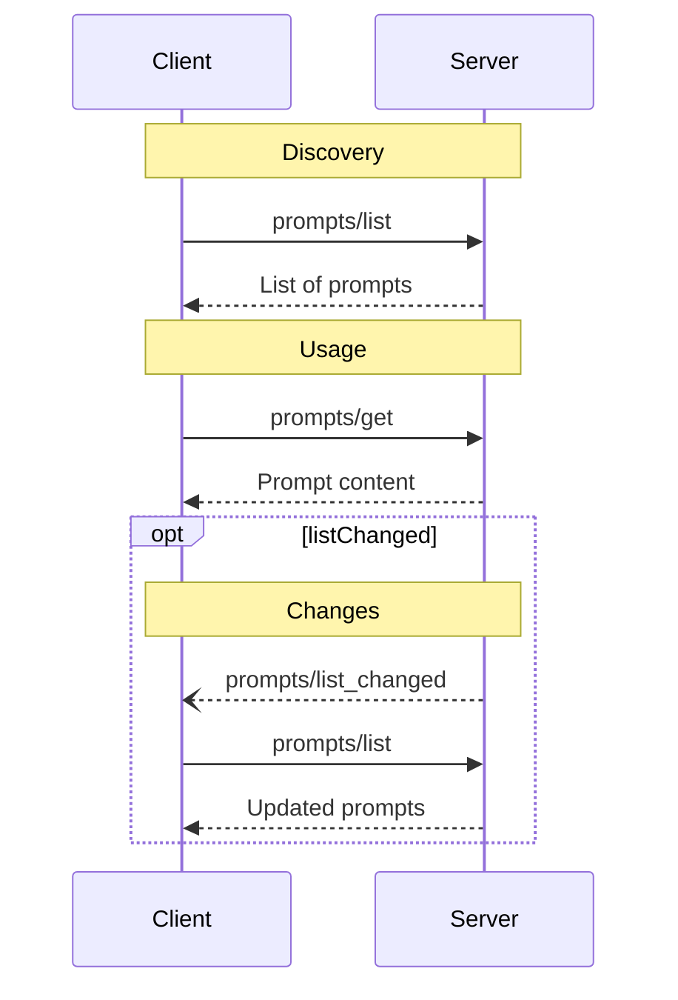

# 프롬프트

<div id="enable-section-numbers" />

<Info>**프로토콜 개정**: 2025-11-25</Info>

Model Context Protocol (MCP)은 서버가 프롬프트 템플릿을 클라이언트에 노출하는 표준화된 방법을 제공합니다. 프롬프트를 통해 서버는 구조화된 메시지와 언어 모델과 상호 작용하기 위한 지침을 제공할 수 있습니다. 클라이언트는 사용 가능한 프롬프트를 탐색하고, 내용을 가져오며, 맞춤화를 위한 인수를 제공할 수 있습니다.

## 사용자 상호 작용 모델

프롬프트는 **사용자 제어**를 염두에 두고 설계되었으며, 이는 서버가 클라이언트에 프롬프트를 노출할 때 사용자가 명시적으로 선택하여 사용할 수 있도록 한다는 의미입니다.

일반적으로 프롬프트는 사용자 인터페이스에서 사용자가 직접 실행하는 명령을 통해 트리거되며, 이를 통해 사용자는 사용 가능한 프롬프트를 자연스럽게 발견하고 호출할 수 있습니다.

예를 들어, 슬래시 명령으로:


하지만 구현자는 필요에 맞는 어떤 인터페이스 패턴을 통해서든 프롬프트를 노출할 자유가 있으며, 프로토콜 자체가 특정 사용자 상호 작용 모델을 강제하지는 않습니다.

## 기능

프롬프트를 지원하는 서버는 [initialization](/specification/2025-11-25/basic/lifecycle#initialization) 동안 `prompts` 기능을 선언해야 **MUST** 합니다:

```json  theme={null}
{
  "capabilities": {
    "prompts": {
      "listChanged": true
    }
  }
}
```

`listChanged`은 사용 가능한 프롬프트 목록이 변경될 때 서버가 알림을 전송할지 여부를 나타냅니다.

## 프로토콜 메시지

### 프롬프트 목록 조회

사용 가능한 프롬프트를 가져오기 위해, 클라이언트는 `prompts/list` 요청을 보냅니다. 이 작업은 [pagination](/specification/2025-11-25/server/utilities/pagination)를 지원합니다.

**Request:**

```json  theme={null}
{
  "jsonrpc": "2.0",
  "id": 1,
  "method": "prompts/list",
  "params": {
    "cursor": "optional-cursor-value"
  }
}
```

**Response:**

```json  theme={null}
{
  "jsonrpc": "2.0",
  "id": 1,
  "result": {
    "prompts": [
      {
        "name": "code_review",
        "title": "Request Code Review",
        "description": "Asks the LLM to analyze code quality and suggest improvements",
        "arguments": [
          {
            "name": "code",
            "description": "The code to review",
            "required": true
          }
        ],
        "icons": [
          {
            "src": "https://example.com/review-icon.svg",
            "mimeType": "image/svg+xml",
            "sizes": ["any"]
          }
        ]
      }
    ],
    "nextCursor": "next-page-cursor"
  }
}
```

### 프롬프트 가져오기

특정 프롬프트를 가져오기 위해, 클라이언트는 `prompts/get` 요청을 보냅니다. 인수는 [the completion API](/specification/2025-11-25/server/utilities/completion)을 통해 자동 완성될 수 있습니다.

**Request:**

```json  theme={null}
{
  "jsonrpc": "2.0",
  "id": 2,
  "method": "prompts/get",
  "params": {
    "name": "code_review",
    "arguments": {
      "code": "def hello():\n    print('world')"
    }
  }
}
```

**Response:**

```json  theme={null}
{
  "jsonrpc": "2.0",
  "id": 2,
  "result": {
    "description": "Code review prompt",
    "messages": [
      {
        "role": "user",
        "content": {
          "type": "text",
          "text": "Please review this Python code:\ndef hello():\n    print('world')"
        }
      }
    ]
  }
}
```

### 목록 변경 알림

사용 가능한 프롬프트 목록이 변경될 때, `listChanged` 기능을 선언한 서버는 알림을 **SHOULD** 전송해야 합니다:

```json  theme={null}
{
  "jsonrpc": "2.0",
  "method": "notifications/prompts/list_changed"
}
```

## 메시지 흐름



## 데이터 타입

### 프롬프트

프롬프트 정의는 다음을 포함합니다:

* `name`: 프롬프트의 고유 식별자
* `title`: 표시 목적을 위한 선택적 인간 친화적 이름
* `description`: 선택적 인간 친화적 설명
* `icons`: 사용자 인터페이스에 표시하기 위한 선택적 아이콘 배열
* `arguments`: 맞춤화를 위한 선택적 인수 목록

### PromptMessage

프롬프트 내 메시지는 다음을 포함할 수 있습니다:

* `role`: 발화자를 나타내는 값으로 "user" 또는 "assistant" 중 하나
* `content`: 다음 콘텐츠 유형 중 하나:

<Note>
  프롬프트 메시지의 모든 콘텐츠 유형은 청중, 우선순위 및 수정 시간에 대한 메타데이터를 위한 선택적 [annotations](./resources#annotations)를 지원합니다.
</Note>

#### 텍스트 콘텐츠

텍스트 콘텐츠는 일반 텍스트 메시지를 나타냅니다:

```json  theme={null}
{
  "type": "text",
  "text": "The text content of the message"
}
```

이는 자연어 상호 작용에 가장 많이 사용되는 콘텐츠 유형입니다.

#### 이미지 콘텐츠

이미지 콘텐츠는 메시지에 시각 정보를 포함할 수 있게 합니다:

```json  theme={null}
{
  "type": "image",
  "data": "base64-encoded-image-data",
  "mimeType": "image/png"
}
```

이미지 데이터는 **MUST** base64 인코딩되어야 하며 유효한 MIME 타입을 포함해야 합니다. 이는 시각적 맥락이 중요한 다중 모달 상호 작용을 가능하게 합니다.

#### 오디오 콘텐츠

오디오 콘텐츠는 메시지에 오디오 정보를 포함할 수 있게 합니다:

```json  theme={null}
{
  "type": "audio",
  "data": "base64-encoded-audio-data",
  "mimeType": "audio/wav"
}
```

오디오 데이터는 **MUST** base64 인코딩되어야 하며 유효한 MIME 타입을 포함해야 합니다. 이는 오디오 맥락이 중요한 다중 모달 상호 작용을 가능하게 합니다.

#### 임베디드 리소스

임베디드 리소스는 메시지에서 서버 측 리소스를 직접 참조할 수 있게 합니다:

```json  theme={null}
{
  "type": "resource",
  "resource": {
    "uri": "resource://example",
    "mimeType": "text/plain",
    "text": "Resource content"
  }
}
```

리소스는 텍스트 또는 바이너리(블롭) 데이터를 포함할 수 있으며 **MUST** 다음을 포함해야 합니다:

* 유효한 리소스 URI
* 적절한 MIME 타입
* 텍스트 콘텐츠 또는 base64 인코딩된 블롭 데이터 중 하나

임베디드 리소스를 통해 프롬프트는 문서, 코드 샘플 또는 기타 참고 자료와 같은 서버 관리 콘텐츠를 대화 흐름에 직접 원활하게 통합할 수 있습니다.

## 오류 처리

서버는 일반적인 실패 사례에 대해 표준 JSON-RPC 오류를 **SHOULD** 반환해야 합니다:

* 잘못된 프롬프트 이름: `-32602` (Invalid params)
* 필수 인수 누락: `-32602` (Invalid params)
* 내부 오류: `-32603` (Internal error)

## 구현 고려 사항

1. 서버는 처리 전에 프롬프트 인수를 **SHOULD** 검증해야 합니다.
2. 클라이언트는 대규모 프롬프트 목록에 대해 페이지네이션을 **SHOULD** 처리해야 합니다.
3. 양측은 기능 협상을 **SHOULD** 존중해야 합니다.

## 보안

구현은 인젝션 공격이나 리소스에 대한 무단 접근을 방지하기 위해 모든 프롬프트 입력 및 출력을 **MUST** 신중히 검증해야 합니다.

---

> 이 문서의 탐색 및 기타 페이지를 찾으려면 다음 주소에서 llms.txt 파일을 가져오세요: https://modelcontextprotocol.io/llms.txt