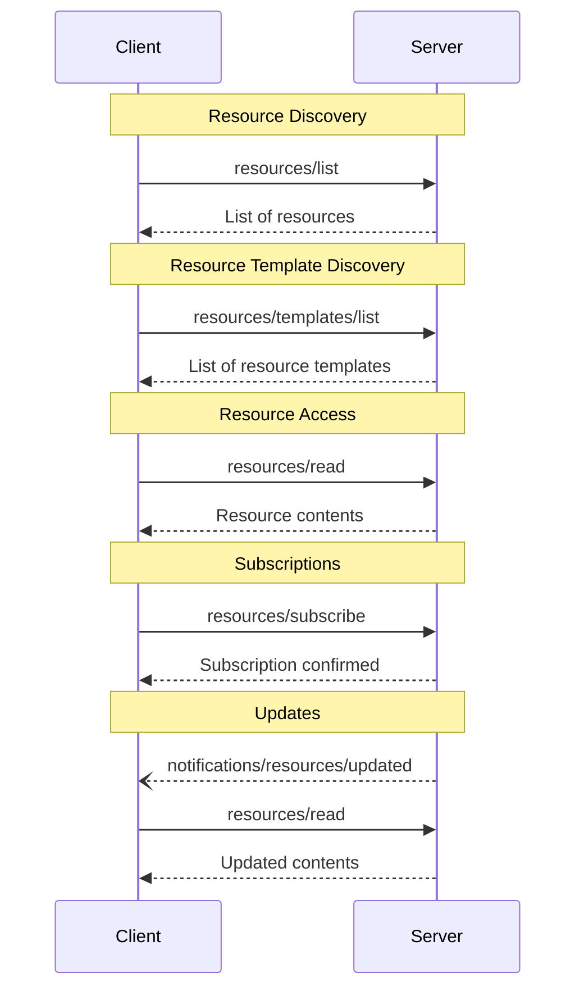

# 리소스

<div id="enable-section-numbers" />

<Info>**프로토콜 개정**: 2025-11-25</Info>

Model Context Protocol (MCP)은 서버가 클라이언트에 리소스를 노출하는 표준화된 방법을 제공합니다. 리소스를 통해 서버는 파일, 데이터베이스 스키마, 애플리케이션 특정 정보와 같이 언어 모델에 컨텍스트를 제공하는 데이터를 공유할 수 있습니다. 각 리소스는 [URI](https://datatracker.ietf.org/doc/html/rfc3986)에 의해 고유하게 식별됩니다.

## 사용자 상호작용 모델

MCP의 리소스는 **애플리케이션 주도** 방식으로 설계되었으며, 호스트 애플리케이션이 필요에 따라 컨텍스트를 통합하는 방법을 결정합니다.

예를 들어, 애플리케이션은 다음과 같이 할 수 있습니다:

* 트리 또는 리스트 뷰와 같은 UI 요소를 통해 리소스를 명시적으로 선택하도록 노출
* 사용자가 사용 가능한 리소스를 검색하고 필터링하도록 허용
* 휴리스틱이나 AI 모델 선택에 기반한 자동 컨텍스트 포함 구현


하지만 구현체는 필요에 맞는 어떤 인터페이스 패턴으로든 리소스를 노출할 수 있으며, 프로토콜 자체가 특정 사용자 상호작용 모델을 강제하지는 않습니다.

## 기능

리소스를 지원하는 서버는 `resources` 기능을 **필수** 선언해야 합니다:

```json  theme={null}
{
  "capabilities": {
    "resources": {
      "subscribe": true,
      "listChanged": true
    }
  }
}
```

이 기능은 두 가지 선택적 기능을 지원합니다:

* `subscribe`: 클라이언트가 개별 리소스 변경에 대한 알림을 구독할 수 있는지 여부.
* `listChanged`: 사용 가능한 리소스 목록이 변경될 때 서버가 알림을 발행하는지 여부.

`subscribe`와 `listChanged`는 모두 선택 사항이며, 서버는 둘 다 지원하지 않거나, 하나만 지원하거나, 모두 지원할 수 있습니다:

```json  theme={null}
{
  "capabilities": {
    "resources": {} // Neither feature supported
  }
}
```

```json  theme={null}
{
  "capabilities": {
    "resources": {
      "subscribe": true // Only subscriptions supported
    }
  }
}
```

```json  theme={null}
{
  "capabilities": {
    "resources": {
      "listChanged": true // Only list change notifications supported
    }
  }
}
```

## 프로토콜 메시지

### 리소스 목록 조회

사용 가능한 리소스를 발견하기 위해 클라이언트는 `resources/list` 요청을 보냅니다. 이 작업은 [pagination](/specification/2025-11-25/server/utilities/pagination)를 지원합니다.

**요청:**

```json  theme={null}
{
  "jsonrpc": "2.0",
  "id": 1,
  "method": "resources/list",
  "params": {
    "cursor": "optional-cursor-value"
  }
}
```

**응답:**

```json  theme={null}
{
  "jsonrpc": "2.0",
  "id": 1,
  "result": {
    "resources": [
      {
        "uri": "file:///project/src/main.rs",
        "name": "main.rs",
        "title": "Rust Software Application Main File",
        "description": "Primary application entry point",
        "mimeType": "text/x-rust",
        "icons": [
          {
            "src": "https://example.com/rust-file-icon.png",
            "mimeType": "image/png",
            "sizes": ["48x48"]
          }
        ]
      }
    ],
    "nextCursor": "next-page-cursor"
  }
}
```

### 리소스 읽기

리소스 내용을 가져오기 위해 클라이언트는 `resources/read` 요청을 보냅니다:

**요청:**

```json  theme={null}
{
  "jsonrpc": "2.0",
  "id": 2,
  "method": "resources/read",
  "params": {
    "uri": "file:///project/src/main.rs"
  }
}
```

**응답:**

```json  theme={null}
{
  "jsonrpc": "2.0",
  "id": 2,
  "result": {
    "contents": [
      {
        "uri": "file:///project/src/main.rs",
        "mimeType": "text/x-rust",
        "text": "fn main() {\n    println!(\"Hello world!\");\n}"
      }
    ]
  }
}
```

### 리소스 템플릿

리소스 템플릿을 통해 서버는 [URI templates](https://datatracker.ietf.org/doc/html/rfc6570)를 사용하여 매개변수화된 리소스를 노출할 수 있습니다. 인자는 [the completion API](/specification/2025-11-25/server/utilities/completion)를 통해 자동 완성될 수 있습니다.

**요청:**

```json  theme={null}
{
  "jsonrpc": "2.0",
  "id": 3,
  "method": "resources/templates/list"
}
```

**응답:**

```json  theme={null}
{
  "jsonrpc": "2.0",
  "id": 3,
  "result": {
    "resourceTemplates": [
      {
        "uriTemplate": "file:///{path}",
        "name": "Project Files",
        "title": "📁 Project Files",
        "description": "Access files in the project directory",
        "mimeType": "application/octet-stream",
        "icons": [
          {
            "src": "https://example.com/folder-icon.png",
            "mimeType": "image/png",
            "sizes": ["48x48"]
          }
        ]
      }
    ]
  }
}
```

### 목록 변경 알림

사용 가능한 리소스 목록이 변경될 때, `listChanged` 기능을 선언한 서버는 알림을 **보내야 합니다**:

```json  theme={null}
{
  "jsonrpc": "2.0",
  "method": "notifications/resources/list_changed"
}
```

### 구독

프로토콜은 리소스 변경에 대한 선택적 구독을 지원합니다. 클라이언트는 특정 리소스를 구독하고 변경 시 알림을 받을 수 있습니다:

**구독 요청:**

```json  theme={null}
{
  "jsonrpc": "2.0",
  "id": 4,
  "method": "resources/subscribe",
  "params": {
    "uri": "file:///project/src/main.rs"
  }
}
```

**업데이트 알림:**

```json  theme={null}
{
  "jsonrpc": "2.0",
  "method": "notifications/resources/updated",
  "params": {
    "uri": "file:///project/src/main.rs"
  }
}
```

## 메시지 흐름



## 데이터 타입

### 리소스

리소스 정의는 다음을 포함합니다:

* `uri`: 리소스의 고유 식별자
* `name`: 리소스의 이름.
* `title`: 표시용으로 선택적인 사람이 읽을 수 있는 리소스 이름.
* `description`: 선택적 설명
* `icons`: 사용자 인터페이스에 표시하기 위한 선택적 아이콘 배열
* `mimeType`: 선택적 MIME 타입
* `size`: 선택적 크기(바이트 단위)

### 리소스 내용

리소스는 텍스트 또는 바이너리 데이터를 포함할 수 있습니다:

#### 텍스트 내용

```json  theme={null}
{
  "uri": "file:///example.txt",
  "mimeType": "text/plain",
  "text": "Resource content"
}
```

#### 바이너리 내용

```json  theme={null}
{
  "uri": "file:///example.png",
  "mimeType": "image/png",
  "blob": "base64-encoded-data"
}
```

### 주석

리소스, 리소스 템플릿 및 콘텐츠 블록은 클라이언트에게 리소스 사용 또는 표시 방법에 대한 힌트를 제공하는 선택적 주석을 지원합니다:

* **`audience`**: 이 리소스의 대상(들)을 나타내는 배열. 유효한 값은 `"user"`와 `"assistant"`입니다. 예를 들어, `["user", "assistant"]`은 두 경우 모두에 유용한 콘텐츠를 나타냅니다.
* **`priority`**: 0.0에서 1.0 사이의 숫자로, 이 리소스의 중요도를 나타냅니다. 1은 "가장 중요함"(실질적으로 필수)이며, 0은 "가장 덜 중요함"(완전 선택적)을 의미합니다.
* **`lastModified`**: ISO 8601 형식의 타임스탬프로, 리소스가 마지막으로 수정된 시점을 나타냅니다(예: `"2025-01-12T15:00:58Z"`).

주석이 포함된 리소스 예시:

```json  theme={null}
{
  "uri": "file:///project/README.md",
  "name": "README.md",
  "title": "Project Documentation",
  "mimeType": "text/markdown",
  "annotations": {
    "audience": ["user"],
    "priority": 0.8,
    "lastModified": "2025-01-12T15:00:58Z"
  }
}
```

클라이언트는 이러한 주석을 사용하여:

* 대상에 따라 리소스를 필터링
* 컨텍스트에 포함할 리소스의 우선순위 지정
* 수정 시간을 표시하거나 최신 순으로 정렬

## 일반 URI 스킴

프로토콜은 여러 표준 URI 스킴을 정의합니다. 이 목록은 전체가 아니며, 구현체는 언제든 추가적인 맞춤형 URI 스킴을 사용할 수 있습니다.

### https\://

웹에서 이용 가능한 리소스를 나타내는 데 사용됩니다.

서버는 클라이언트가 웹에서 직접 리소스를 가져와 로드할 수 있을 때만 이 스킴을 **사용해야 합니다**—즉, MCP 서버를 통해 리소스를 읽을 필요가 없을 경우입니다.

다른 사용 사례에서는 서버가 인터넷을 통해 리소스 내용을 다운로드하더라도, 다른 URI 스킴을 사용하거나 맞춤형 스킴을 정의하는 것이 **바람직합니다**.

### file://

파일 시스템처럼 동작하는 리소스를 식별하는 데 사용됩니다. 그러나 리소스가 실제 물리적 파일 시스템에 매핑될 필요는 없습니다.

MCP 서버는 [XDG MIME type](https://specifications.freedesktop.org/shared-mime-info-spec/0.14/ar01s02.html#id-1.3.14)와 같은 `inode/directory`를 사용하여 표준 MIME 타입이 없는 비정규 파일(예: 디렉터리) 등을 나타내기 위해 file:// 리소스를 식별할 **수 있습니다**.

### git://

Git 버전 관리 통합.

### Custom URI Schemes

맞춤형 URI 스킴은 [RFC3986](https://datatracker.ietf.org/doc/html/rfc3986)에 따라야 하며, 위의 지침을 고려해야 합니다.

## 오류 처리

서버는 일반적인 실패 경우에 대해 표준 JSON-RPC 오류를 **반환해야 합니다**:

* 리소스를 찾을 수 없음: `-32002`
* 내부 오류: `-32603`

오류 예시:

```json  theme={null}
{
  "jsonrpc": "2.0",
  "id": 5,
  "error": {
    "code": -32002,
    "message": "Resource not found",
    "data": {
      "uri": "file:///nonexistent.txt"
    }
  }
}
```

## 보안 고려사항

1. 서버는 모든 리소스 URI를 **검증해야 합니다**
2. 민감한 리소스에 대해 접근 제어를 **구현해야 합니다**
3. 바이너리 데이터는 **적절히 인코딩**되어야 합니다
4. 작업 수행 전에 리소스 권한을 **확인해야 합니다**

---

> 이 문서의 탐색 및 기타 페이지를 찾으려면, 다음 위치에서 llms.txt 파일을 가져오세요: https://modelcontextprotocol.io/llms.txt