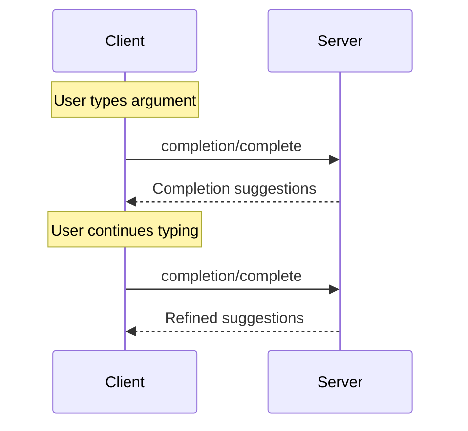

# 완성

<div id="enable-section-numbers" />

<Info>**프로토콜 개정**: 2025-11-25</Info>

Model Context Protocol (MCP)은 서버가 프롬프트와 리소스 템플릿의 인수에 대한 자동완성 제안을 제공하는 표준화된 방법을 제공합니다. 사용자가 특정 프롬프트(이름으로 식별) 또는 리소스 템플릿(URI로 식별)의 인수 값을 입력할 때, 서버는 상황에 맞는 제안을 제공할 수 있습니다.

## 사용자 상호작용 모델

MCP의 완성은 IDE 코드 완성과 유사한 인터랙티브한 사용자 경험을 지원하도록 설계되었습니다.

예를 들어, 애플리케이션은 사용자가 입력하는 동안 드롭다운이나 팝업 메뉴에 완성 제안을 표시하고, 사용자는 제공된 옵션을 필터링하고 선택할 수 있습니다.

그러나 구현은 필요에 맞는 어떤 인터페이스 패턴을 통해서든 완성을 노출할 수 있으며, 프로토콜 자체가 특정 사용자 상호작용 모델을 강제하지는 않습니다.

## 기능

완성을 지원하는 서버는 반드시 `completions` 기능을 선언해야 합니다:

```json  theme={null}
{
  "capabilities": {
    "completions": {}
  }
}
```

## 프로토콜 메시지

### 완성 요청

완성 제안을 받기 위해 클라이언트는 `completion/complete` 요청을 보내며, 어떤 항목을 완성하고 있는지를 참조 유형으로 지정합니다:

**요청:**

```json  theme={null}
{
  "jsonrpc": "2.0",
  "id": 1,
  "method": "completion/complete",
  "params": {
    "ref": {
      "type": "ref/prompt",
      "name": "code_review"
    },
    "argument": {
      "name": "language",
      "value": "py"
    }
  }
}
```

**응답:**

```json  theme={null}
{
  "jsonrpc": "2.0",
  "id": 1,
  "result": {
    "completion": {
      "values": ["python", "pytorch", "pyside"],
      "total": 10,
      "hasMore": true
    }
  }
}
```

프롬프트나 URI 템플릿에 인수가 여러 개 있는 경우, 클라이언트는 `context.arguments` 객체에 이전 완성 결과를 포함시켜 이후 요청에 대한 컨텍스트를 제공해야 합니다.

**요청:**

```json  theme={null}
{
  "jsonrpc": "2.0",
  "id": 1,
  "method": "completion/complete",
  "params": {
    "ref": {
      "type": "ref/prompt",
      "name": "code_review"
    },
    "argument": {
      "name": "framework",
      "value": "fla"
    },
    "context": {
      "arguments": {
        "language": "python"
      }
    }
  }
}
```

**응답:**

```json  theme={null}
{
  "jsonrpc": "2.0",
  "id": 1,
  "result": {
    "completion": {
      "values": ["flask"],
      "total": 1,
      "hasMore": false
    }
  }
}
```

### 참조 유형

프로토콜은 두 가지 유형의 완성 참조를 지원합니다:

| 유형 | 설명 | 예시 |
| -------------- | --------------------------- | --------------------------------------------------- |
| `ref/prompt` | 이름으로 프롬프트를 참조 | `{"type": "ref/prompt", "name": "code_review"}` |
| `ref/resource` | 리소스 URI를 참조 | `{"type": "ref/resource", "uri": "file:///{path}"}` |

### 완성 결과

서버는 관련성에 따라 순위가 매겨진 완성 값 배열을 반환하며, 다음을 포함합니다:

* 응답당 최대 100개 항목
* 선택 사항인 전체 매치 수
* 추가 결과 존재 여부를 나타내는 불리언

## 메시지 흐름



## 데이터 유형

### CompleteRequest

* `ref`: `PromptReference` 또는 `ResourceReference`
* `argument`: 다음을 포함하는 객체:
  * `name`: 인수 이름
  * `value`: 현재 값
* `context`: 다음을 포함하는 객체:
  * `arguments`: 이미 해결된 인수 이름과 그 값의 매핑

### CompleteResult

* `completion`: 다음을 포함하는 객체:
  * `values`: 제안 배열 (최대 100개)
  * `total`: 선택 사항인 전체 매치 수
  * `hasMore`: 추가 결과 플래그

## 오류 처리

서버는 일반적인 실패 사례에 대해 표준 JSON-RPC 오류를 **반환해야** 합니다:

* 메서드 없음: `-32601` (지원되지 않는 기능)
* 잘못된 프롬프트 이름: `-32602` (잘못된 매개변수)
* 필수 인수 누락: `-32602` (잘못된 매개변수)
* 내부 오류: `-32603` (내부 오류)

## 구현 고려사항

1. 서버는 **다음과 같이 해야** 합니다:
   * 관련성에 따라 제안을 정렬
   * 적절한 경우 퍼지 매칭 구현
   * 완성 요청에 대한 속도 제한 적용
   * 모든 입력 검증
2. 클라이언트는 **다음과 같이 해야** 합니다:
   * 빠른 완성 요청을 디바운스
   * 적절한 경우 완성 결과 캐시
   * 누락되거나 부분적인 결과를 우아하게 처리

## 보안

구현은 **반드시**:

* 모든 완성 입력을 검증
* 적절한 속도 제한을 구현
* 민감한 제안에 대한 접근을 제어
* 완성 기반 정보 유출을 방지


---

> 이 문서에서 탐색 및 기타 페이지를 찾으려면 다음 주소에서 llms.txt 파일을 가져오세요: https://modelcontextprotocol.io/llms.txt