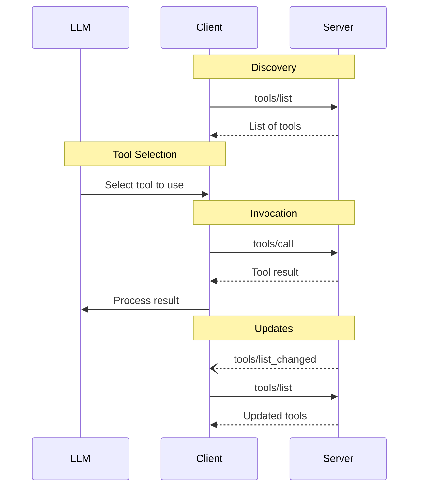

# 도구

<div id="enable-section-numbers" />

<Info>**프로토콜 개정**: 2025-11-25</Info>

Model Context Protocol (MCP)은 서버가 언어 모델에 의해 호출될 수 있는 도구를 노출하도록 허용합니다. 도구는 모델이 데이터베이스 조회, API 호출, 연산 수행 등 외부 시스템과 상호작용할 수 있게 합니다. 각 도구는 이름으로 고유하게 식별되며, 스키마를 설명하는 메타데이터를 포함합니다.

## 사용자 상호작용 모델

MCP의 도구는 **모델 제어** 방식으로 설계되어, 언어 모델이 상황에 대한 이해와 사용자의 프롬프트를 기반으로 도구를 자동으로 발견하고 호출할 수 있습니다.

그러나 구현자는 필요에 따라 어떤 인터페이스 패턴으로든 도구를 노출할 수 있으며, 프로토콜 자체가 특정 사용자 상호작용 모델을 강제하지 않습니다.

<Warning>
  신뢰·안전 및 보안을 위해, **항상** 인간이 개입하여 도구 호출을 거부할 수 있어야 합니다.

  애플리케이션은 **다음과 같이 해야 합니다**:

  * AI 모델에 노출되는 도구를 명확히 표시하는 UI 제공
  * 도구가 호출될 때 명확한 시각적 표시 삽입
  * 인간이 개입하도록 보장하기 위해 작업에 대한 확인 프롬프트를 사용자에게 제시
</Warning>

## 기능

도구를 지원하는 서버는 반드시 `tools` 기능을 선언해야 합니다:

```json  theme={null}
{
  "capabilities": {
    "tools": {
      "listChanged": true
    }
  }
}
```

`listChanged`은 서버가 사용 가능한 도구 목록이 변경될 때 알림을 보낼지 여부를 나타냅니다.

## 프로토콜 메시지

### 도구 목록 조회

사용 가능한 도구를 발견하려면, 클라이언트는 `tools/list` 요청을 보냅니다. 이 작업은 [pagination](/specification/2025-11-25/server/utilities/pagination)을 지원합니다.

**요청:**

```json  theme={null}
{
  "jsonrpc": "2.0",
  "id": 1,
  "method": "tools/list",
  "params": {
    "cursor": "optional-cursor-value"
  }
}
```

**응답:**

```json  theme={null}
{
  "jsonrpc": "2.0",
  "id": 1,
  "result": {
    "tools": [
      {
        "name": "get_weather",
        "title": "Weather Information Provider",
        "description": "Get current weather information for a location",
        "inputSchema": {
          "type": "object",
          "properties": {
            "location": {
              "type": "string",
              "description": "City name or zip code"
            }
          },
          "required": ["location"]
        },
        "icons": [
          {
            "src": "https://example.com/weather-icon.png",
            "mimeType": "image/png",
            "sizes": ["48x48"]
          }
        ]
      }
    ],
    "nextCursor": "next-page-cursor"
  }
}
```

### 도구 호출

도구를 호출하려면, 클라이언트는 `tools/call` 요청을 보냅니다:

**요청:**

```json  theme={null}
{
  "jsonrpc": "2.0",
  "id": 2,
  "method": "tools/call",
  "params": {
    "name": "get_weather",
    "arguments": {
      "location": "New York"
    }
  }
}
```

**응답:**

```json  theme={null}
{
  "jsonrpc": "2.0",
  "id": 2,
  "result": {
    "content": [
      {
        "type": "text",
        "text": "Current weather in New York:\nTemperature: 72°F\nConditions: Partly cloudy"
      }
    ],
    "isError": false
  }
}
```

### 목록 변경 알림

사용 가능한 도구 목록이 변경될 때, `listChanged` 기능을 선언한 서버는 **알림을 보내야 합니다**:

```json  theme={null}
{
  "jsonrpc": "2.0",
  "method": "notifications/tools/list_changed"
}
```

## 메시지 흐름



## 데이터 타입

### Tool

도구 정의에는 다음이 포함됩니다:

* `name`: 도구의 고유 식별자
* `title`: 표시 목적을 위한 선택적 인간이 읽을 수 있는 도구 이름
* `description`: 기능에 대한 인간이 읽을 수 있는 설명
* `icons`: 사용자 인터페이스에 표시하기 위한 선택적 아이콘 배열
* `inputSchema`: 기대되는 매개변수를 정의하는 JSON Schema
  * [JSON Schema usage guidelines](/specification/2025-11-25/basic#json-schema-usage)을 따름
  * `$schema` 필드가 없을 경우 기본값은 2020-12
  * **유효한 JSON Schema 객체**여야 함 (`null`이 아님)
  * 매개변수가 없는 도구의 경우, 다음 중 하나의 유효한 접근 방식을 사용:
    * `{ "type": "object", "additionalProperties": false }` - **권장**: 빈 객체만 명시적으로 허용
    * `{ "type": "object" }` - 속성이 포함된 객체를 포함한 모든 객체 허용
* `outputSchema`: 기대되는 출력 구조를 정의하는 선택적 JSON Schema
  * [JSON Schema usage guidelines](/specification/2025-11-25/basic#json-schema-usage)을 따름
  * `$schema` 필드가 없을 경우 기본값은 2020-12
* `annotations`: 도구 동작을 설명하는 선택적 속성

<Warning>
  신뢰·안전 및 보안을 위해, 클라이언트는 **신뢰할 수 없는** 서버에서 온 것이 아니라면 도구 주석을 신뢰하지 않아야 합니다.
</Warning>

#### 도구 이름

* 도구 이름은 **길이가 1~128자**(포함)이어야 합니다.
* 도구 이름은 **대소문자를 구분**해야 합니다.
* 허용되는 문자: 대문자·소문자 ASCII 알파벳(A‑Z, a‑z), 숫자(0‑9), 밑줄(_), 하이픈(-), 마침표(.)
* 도구 이름에 공백, 쉼표 또는 기타 특수 문자를 포함해서는 **안 됩니다**.
* 도구 이름은 서버 내에서 **고유**해야 합니다.
* 유효한 도구 이름 예시:
  * getUser
  * DATA_EXPORT_v2
  * admin.tools.list

### Tool Result

도구 결과는 [**structured**](#structured-content) 또는 **구조화되지 않은** 콘텐츠를 포함할 수 있습니다.

**구조화되지 않은** 콘텐츠는 결과의 `content` 필드에 반환되며, 서로 다른 유형의 여러 콘텐츠 항목을 포함할 수 있습니다:

<Note>
  모든 콘텐츠 유형(텍스트, 이미지, 오디오, 리소스 링크, 임베디드 리소스)은 선택적인 [annotations](/specification/2025-11-25/server/resources#annotations)을 지원하여 청중, 우선순위, 수정 시간 등에 대한 메타데이터를 제공합니다. 이는 리소스와 프롬프트에서 사용되는 동일한 주석 형식입니다.
</Note>

#### 텍스트 콘텐츠

```json  theme={null}
{
  "type": "text",
  "text": "Tool result text"
}
```

#### 이미지 콘텐츠

```json  theme={null}
{
  "type": "image",
  "data": "base64-encoded-data",
  "mimeType": "image/png",
  "annotations": {
    "audience": ["user"],
    "priority": 0.9
  }
}
```

#### 오디오 콘텐츠

```json  theme={null}
{
  "type": "audio",
  "data": "base64-encoded-audio-data",
  "mimeType": "audio/wav"
}
```

#### 리소스 링크

도구는 추가 컨텍스트나 데이터를 제공하기 위해 [Resources](/specification/2025-11-25/server/resources)에 대한 링크를 **반환할 수 있습니다**. 이 경우 도구는 클라이언트가 구독하거나 가져올 수 있는 URI를 반환합니다:

```json  theme={null}
{
  "type": "resource_link",
  "uri": "file:///project/src/main.rs",
  "name": "main.rs",
  "description": "Primary application entry point",
  "mimeType": "text/x-rust"
}
```

리소스 링크는 일반 리소스와 동일한 [Resource annotations](/specification/2025-11-25/server/resources#annotations)를 지원하여 클라이언트가 사용 방법을 이해하도록 돕습니다.

<Info>
  도구가 반환한 리소스 링크가 `resources/list` 요청의 결과에 반드시 포함된다는 보장은 없습니다.
</Info>

#### 임베디드 리소스

[Resources](/specification/2025-11-25/server/resources)은 추가 컨텍스트나 데이터를 제공하기 위해 적절한 [URI scheme](./resources#common-uri-schemes)를 사용하여 **임베드될 수 있습니다**. 임베디드 리소스를 사용하는 서버는 `resources` 기능을 **구현해야 합니다**:

```json  theme={null}
{
  "type": "resource",
  "resource": {
    "uri": "file:///project/src/main.rs",
    "mimeType": "text/x-rust",
    "text": "fn main() {\n    println!(\"Hello world!\");\n}",
    "annotations": {
      "audience": ["user", "assistant"],
      "priority": 0.7,
      "lastModified": "2025-05-03T14:30:00Z"
    }
  }
}
```

임베디드 리소스는 일반 리소스와 동일한 [Resource annotations](/specification/2025-11-25/server/resources#annotations)를 지원하여 클라이언트가 사용 방법을 이해하도록 돕습니다.

#### 구조화된 콘텐츠

**구조화된** 콘텐츠는 결과의 `structuredContent` 필드에 JSON 객체 형태로 반환됩니다.

하위 호환성을 위해, 구조화된 콘텐츠를 반환하는 도구는 텍스트 콘텐츠 블록에도 직렬화된 JSON을 **반환해야 합니다**.

#### 출력 스키마

도구는 구조화된 결과 검증을 위해 출력 스키마를 제공할 수 있습니다. 출력 스키마가 제공되는 경우:

* 서버는 이 스키마에 부합하는 구조화된 결과를 **제공해야 합니다**.
* 클라이언트는 이 스키마에 대해 구조화된 결과를 **검증해야 합니다**.

출력 스키마가 포함된 도구 예시:

```json  theme={null}
{
  "name": "get_weather_data",
  "title": "Weather Data Retriever",
  "description": "Get current weather data for a location",
  "inputSchema": {
    "type": "object",
    "properties": {
      "location": {
        "type": "string",
        "description": "City name or zip code"
      }
    },
    "required": ["location"]
  },
  "outputSchema": {
    "type": "object",
    "properties": {
      "temperature": {
        "type": "number",
        "description": "Temperature in celsius"
      },
      "conditions": {
        "type": "string",
        "description": "Weather conditions description"
      },
      "humidity": {
        "type": "number",
        "description": "Humidity percentage"
      }
    },
    "required": ["temperature", "conditions", "humidity"]
  }
}
```

이 도구에 대한 유효한 응답 예시:

```json  theme={null}
{
  "jsonrpc": "2.0",
  "id": 5,
  "result": {
    "content": [
      {
        "type": "text",
        "text": "{\"temperature\": 22.5, \"conditions\": \"Partly cloudy\", \"humidity\": 65}"
      }
    ],
    "structuredContent": {
      "temperature": 22.5,
      "conditions": "Partly cloudy",
      "humidity": 65
    }
  }
}
```

출력 스키마를 제공하면 클라이언트와 LLM이 구조화된 도구 출력을 이해하고 적절히 처리하는 데 도움이 됩니다:

* 응답에 대한 엄격한 스키마 검증 가능
* 프로그래밍 언어와의 통합을 위한 타입 정보 제공
* 반환된 데이터를 올바르게 파싱하고 활용하도록 클라이언트와 LLM을 안내
* 문서화 및 개발자 경험 향상 지원

### 스키마 예시

#### 기본 2020-12 스키마를 가진 도구:

```json  theme={null}
{
  "name": "calculate_sum",
  "description": "Add two numbers",
  "inputSchema": {
    "type": "object",
    "properties": {
      "a": { "type": "number" },
      "b": { "type": "number" }
    },
    "required": ["a", "b"]
  }
}
```

#### draft-07 스키마를 명시적으로 지정한 도구:

```json  theme={null}
{
  "name": "calculate_sum",
  "description": "Add two numbers",
  "inputSchema": {
    "$schema": "http://json-schema.org/draft-07/schema#",
    "type": "object",
    "properties": {
      "a": { "type": "number" },
      "b": { "type": "number" }
    },
    "required": ["a", "b"]
  }
}
```

#### 매개변수가 없는 도구:

```json  theme={null}
{
  "name": "get_current_time",
  "description": "Returns the current server time",
  "inputSchema": {
    "type": "object",
    "additionalProperties": false
  }
}
```

## 오류 처리

도구는 두 가지 오류 보고 메커니즘을 사용합니다:

1. **프로토콜 오류**: 다음과 같은 문제에 대한 표준 JSON-RPC 오류
   * 알 수 없는 도구
   * [CallToolRequest schema](specification/2025-11-25/schema#calltoolrequest)을 충족하지 못하는 잘못된 요청
   * 서버 오류

2. **도구 실행 오류**: `isError: true`을 통해 도구 결과에 보고
   * API 실패
   * 입력 검증 오류(예: 잘못된 형식의 날짜, 범위를 벗어난 값)
   * 비즈니스 로직 오류

**도구 실행 오류**는 언어 모델이 자체 수정하고 매개변수를 조정하여 재시도할 수 있도록 하는 실행 가능한 피드백을 포함합니다.
**프로토콜 오류**는 요청 구조 자체의 문제를 나타내며 모델이 스스로 해결하기 어려울 수 있습니다.
클라이언트는 **도구 실행 오류를** 언어 모델에 제공하여 자체 수정이 가능하도록 해야 합니다.
클라이언트는 **프로토콜 오류를** 언어 모델에 제공할 수 있지만, 성공적인 복구 가능성은 낮습니다.

프로토콜 오류 예시:

```json  theme={null}
{
  "jsonrpc": "2.0",
  "id": 3,
  "error": {
    "code": -32602,
    "message": "Unknown tool: invalid_tool_name"
  }
}
```

도구 실행 오류 예시(입력 검증):

```json  theme={null}
{
  "jsonrpc": "2.0",
  "id": 4,
  "result": {
    "content": [
      {
        "type": "text",
        "text": "Invalid departure date: must be in the future. Current date is 08/08/2025."
      }
    ],
    "isError": true
  }
}
```

## 보안 고려 사항

1. 서버는 **다음 사항을 반드시 수행해야 합니다**:
   * 모든 도구 입력 검증
   * 적절한 접근 제어 구현
   * 도구 호출에 대한 속도 제한
   * 도구 출력 정제

2. 클라이언트는 **다음 사항을 권장합니다**:
   * 민감한 작업에 대해 사용자 확인 프롬프트 표시
   * 서버 호출 전에 도구 입력을 사용자에게 보여 악의적·우발적 데이터 유출 방지
   * LLM에 전달하기 전에 도구 결과 검증
   * 도구 호출에 대한 타임아웃 구현
   * 감사 목적을 위해 도구 사용 로그 기록


---

> 이 문서의 탐색 및 기타 페이지를 찾으려면 다음 주소에서 llms.txt 파일을 가져오세요: https://modelcontextprotocol.io/llms.txt