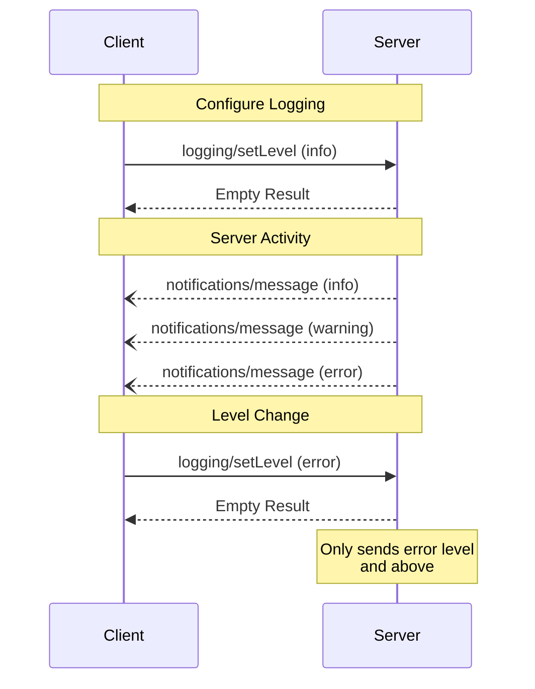

# 로깅

<div id="enable-section-numbers" />

<Info>**프로토콜 개정**: 2025-11-25</Info>

Model Context Protocol (MCP)은 서버가 구조화된 로그 메시지를 클라이언트에 전송하는 표준화된 방법을 제공합니다. 클라이언트는 최소 로그 레벨을 설정하여 로깅 상세 정도를 제어할 수 있으며, 서버는 심각도 수준, 선택적 로거 이름 및 임의의 JSON 직렬화 가능한 데이터를 포함한 알림을 전송합니다.

## 사용자 상호작용 모델

구현은 필요에 맞는 어떤 인터페이스 패턴을 통해 로깅을 노출해도 자유롭습니다—프로토콜 자체는 특정 사용자 상호작용 모델을 강제하지 않습니다.

## 기능

로그 메시지 알림을 발행하는 서버는 **MUST** `logging` 기능을 선언해야 합니다:

```json  theme={null}
{
  "capabilities": {
    "logging": {}
  }
}
```

## 로그 레벨

프로토콜은 [RFC 5424](https://datatracker.ietf.org/doc/html/rfc5424#section-6.2.1)에 명시된 표준 syslog 심각도 레벨을 따릅니다:

| 레벨      | 설명                              | 예시 사용 사례               |
| --------- | --------------------------------- | ---------------------------- |
| debug     | 상세 디버깅 정보                  | 함수 진입/종료 지점          |
| info      | 일반 정보 메시지                  | 작업 진행 상황 업데이트      |
| notice    | 정상적이지만 중요한 이벤트        | 구성 변경                    |
| warning   | 경고 상황                          | 사용 중단된 기능 사용        |
| error     | 오류 상황                          | 작업 실패                    |
| critical  | 치명적 상황                        | 시스템 구성 요소 실패        |
| alert     | 즉시 조치가 필요함                | 데이터 손상 감지             |
| emergency | 시스템 사용 불가                  | 전체 시스템 실패            |

## 프로토콜 메시지

### 로그 레벨 설정

최소 로그 레벨을 구성하려면 클라이언트는 **MAY** `logging/setLevel` 요청을 보낼 수 있습니다:

**요청:**

```json  theme={null}
{
  "jsonrpc": "2.0",
  "id": 1,
  "method": "logging/setLevel",
  "params": {
    "level": "info"
  }
}
```

### 로그 메시지 알림

서버는 `notifications/message` 알림을 사용해 로그 메시지를 전송합니다:

```json  theme={null}
{
  "jsonrpc": "2.0",
  "method": "notifications/message",
  "params": {
    "level": "error",
    "logger": "database",
    "data": {
      "error": "Connection failed",
      "details": {
        "host": "localhost",
        "port": 5432
      }
    }
  }
}
```

## 메시지 흐름



## 오류 처리

서버는 일반적인 실패 사례에 대해 표준 JSON-RPC 오류를 반환 **SHOULD** 합니다:

* 잘못된 로그 레벨: `-32602` (Invalid params)
* 구성 오류: `-32603` (Internal error)

## 구현 고려사항

1. 서버는 **SHOULD**:
   * 로그 메시지 속도 제한
   * 데이터 필드에 관련 컨텍스트 포함
   * 일관된 로거 이름 사용
   * 민감한 정보 제거

2. 클라이언트는 **MAY**:
   * UI에 로그 메시지 표시
   * 로그 필터링/검색 구현
   * 심각도 시각적으로 표시
   * 로그 메시지 영구 저장

## 보안

1. 로그 메시지는 **MUST NOT** 포함해서는 안 됩니다:
   * 자격 증명 또는 비밀
   * 개인 식별 정보
   * 공격에 활용될 수 있는 내부 시스템 상세 정보

2. 구현은 **SHOULD**:
   * 메시지 속도 제한
   * 모든 데이터 필드 검증
   * 로그 접근 제어
   * 민감한 콘텐츠 모니터링


---

> 이 문서에서 탐색 및 기타 페이지를 찾으려면 다음 주소에서 llms.txt 파일을 가져오세요: https://modelcontextprotocol.io/llms.txt