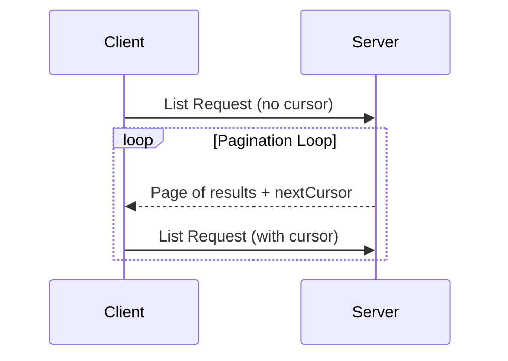

# 페이지네이션

<div id="enable-section-numbers" />

<Info>**프로토콜 개정**: 2025-11-25</Info>

Model Context Protocol (MCP)은 대용량 결과 집합을 반환할 수 있는 목록 작업에 대한 페이지네이션을 지원합니다. 페이지네이션을 통해 서버는 결과를 한 번에 모두 제공하는 대신 작은 청크로 나누어 제공할 수 있습니다.

페이지네이션은 특히 인터넷을 통해 외부 서비스에 연결할 때 중요하지만, 대용량 데이터 세트로 인한 성능 문제를 피하기 위해 로컬 통합에서도 유용합니다.

## 페이지네이션 모델

MCP의 페이지네이션은 번호 매긴 페이지 대신 불투명 커서 기반 방식을 사용합니다.

* **cursor**는 결과 집합 내 위치를 나타내는 불투명 문자열 토큰입니다.
* **Page size**는 서버에 의해 결정되며, 클라이언트는 고정된 페이지 크기를 가정해서는 **안 됩니다**.

## 응답 형식

페이지네이션은 서버가 다음을 포함하는 **응답**을 보낼 때 시작됩니다:

* 현재 페이지의 결과
* 추가 결과가 존재할 경우 선택적인 `nextCursor` 필드

```json  theme={null}
{
  "jsonrpc": "2.0",
  "id": "123",
  "result": {
    "resources": [...],
    "nextCursor": "eyJwYWdlIjogM30="
  }
}
```

## 요청 형식

커서를 받은 후, 클라이언트는 해당 커서를 포함한 요청을 발행하여 페이지네이션을 *계속*할 수 있습니다:

```json  theme={null}
{
  "jsonrpc": "2.0",
  "id": "124",
  "method": "resources/list",
  "params": {
    "cursor": "eyJwYWdlIjogMn0="
  }
}
```

## 페이지네이션 흐름



## 페이지네이션을 지원하는 작업

다음 MCP 작업은 페이지네이션을 지원합니다:

* `resources/list` - 사용 가능한 리소스 목록
* `resources/templates/list` - 리소스 템플릿 목록
* `prompts/list` - 사용 가능한 프롬프트 목록
* `tools/list` - 사용 가능한 도구 목록

## 구현 지침

1. 서버는 **SHOULD**:
   * 안정적인 커서를 제공
   * 잘못된 커서를 우아하게 처리

2. 클라이언트는 **SHOULD**:
   * 누락된 `nextCursor`를 결과의 끝으로 간주
   * 페이지네이션 흐름과 비페이지네이션 흐름 모두 지원

3. 클라이언트는 **MUST** 커서를 불투명 토큰으로 취급:
   * 커서 형식에 대해 가정하지 않음
   * 커서를 파싱하거나 수정하려 시도하지 않음
   * 세션 간에 커서를 지속하지 않음

## 오류 처리

잘못된 커서는 **SHOULD** -32602 코드(Invalid params)의 오류를 발생시켜야 합니다.

---

> 이 문서에서 탐색 및 기타 페이지를 찾으려면 다음 주소에서 llms.txt 파일을 가져오세요: https://modelcontextprotocol.io/llms.txt